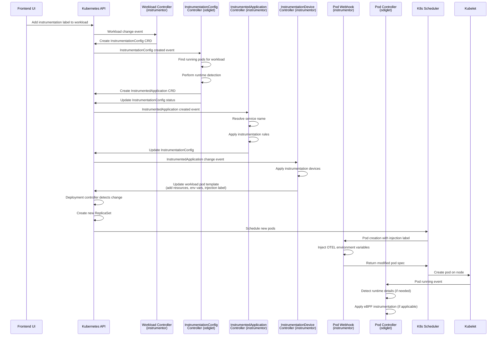
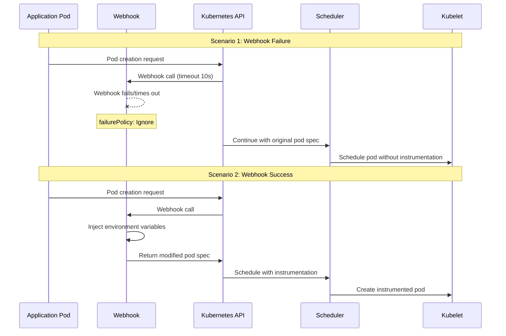

# Odigos Complete Backend Flow Documentation

## Table of Contents
1. [Overview](#overview)
2. [CRD Ownership and Creation](#crd-ownership-and-creation)
3. [Complete Flow Sequence](#complete-flow-sequence)
4. [Detailed Component Analysis](#detailed-component-analysis)
5. [Webhook Configuration and Failure Handling](#webhook-configuration-and-failure-handling)
6. [Pod Lifecycle and Kubernetes Integration](#pod-lifecycle-and-kubernetes-integration)
7. [Sequence Diagrams](#sequence-diagrams)
8. [Failure Scenarios](#failure-scenarios)
9. [Multi-Container Pod Handling](#multi-container-pod-handling)

## Overview

Odigos implements a sophisticated instrumentation system that automatically detects, configures, and injects observability into Kubernetes workloads. The system consists of multiple controllers working in coordination across different modules.

## CRD Ownership and Creation

### InstrumentationConfig CRD
- **Owner**: `instrumentor` module
- **Created by**: `startlangdetection` controllers in instrumentor
- **Purpose**: Stores runtime detection results and instrumentation configuration
- **Location**: `api/odigos/v1alpha1/instrumentationconfig_types.go`

### InstrumentedApplication CRD  
- **Owner**: `odiglet` module
- **Created by**: `odiglet` runtime detection controllers
- **Purpose**: Stores detailed runtime information for each container
- **Location**: `api/odigos/v1alpha1/instrumentedapplication_types.go`

## Complete Flow Sequence

### 1. UI Adds Instrumentation Label
```yaml
# User adds this label via UI to a workload
metadata:
  labels:
    odigos.io/instrumentation: enabled
```

### 2. Workload Controller Detection (instrumentor)
**File**: `instrumentor/controllers/startlangdetection/workload_controllers.go`

```go
// Triggered when workload gets instrumentation label
func reconcileWorkload(ctx context.Context, k8sClient client.Client, objKind workload.WorkloadKind, req ctrl.Request, scheme *runtime.Scheme) (ctrl.Result, error) {
    // Check if workload is instrumented
    instrumented, err := workload.IsWorkloadInstrumentationEffectiveEnabled(ctx, k8sClient, obj)
    if !instrumented {
        return ctrl.Result{}, nil
    }
    
    // Request odiglets to calculate runtime details
    err = requestOdigletsToCalculateRuntimeDetails(ctx, k8sClient, instConfigName, req.Namespace, obj, scheme)
    return ctrl.Result{}, err
}
```

**Process**:
1. Workload predicate filters for instrumentation-enabled workloads
2. Creates `InstrumentationConfig` CRD with empty runtime details
3. Signals odiglets to start runtime detection

### 3. Runtime Detection (odiglet)

#### 3.1 InstrumentationConfig Controller (odiglet)
**File**: `odiglet/pkg/kube/runtime_details/instrumentationconfigs_controller.go`

```go
func (r *InstrumentationConfigReconciler) Reconcile(ctx context.Context, request reconcile.Request) (reconcile.Result, error) {
    // Only process new InstrumentationConfigs without runtime details
    if len(instrumentationConfig.Status.RuntimeDetailsByContainer) == 0 {
        // Find running pods for this workload
        pods, err := kubeutils.GetRunningPods(ctx, labels, workload.GetNamespace(), r.Client)
        
        // Select pod with newest generation for inspection
        selectedPodForInspection := selectNewestPod(pods, instrumentationConfig.Status.ObservedWorkloadGeneration)
        
        // Perform runtime inspection
        runtimeResults, err := runtimeInspection([]corev1.Pod{*selectedPodForInspection}, odigosConfig.IgnoredContainers)
        
        // Persist results to InstrumentationConfig
        err = persistRuntimeDetailsToInstrumentationConfig(ctx, r.Client, &instrumentationConfig, status)
    }
}
```

#### 3.2 Runtime Inspection Process
**File**: `odiglet/pkg/kube/runtime_details/inspection.go`

**Process**:
1. **Container Analysis**: Examines each container in the pod
2. **Process Detection**: Uses `/proc` filesystem to detect running processes
3. **Language Detection**: Analyzes process names, environment variables, and file systems
4. **Version Detection**: Determines runtime versions (Node.js, Python, Java, etc.)
5. **Environment Analysis**: Checks for existing instrumentation agents

### 4. InstrumentedApplication Creation (odiglet)
**File**: `odiglet/pkg/kube/runtime_details/instconfig_controller.go`

```go
func persistRuntimeDetailsToInstrumentationConfig(ctx context.Context, client client.Client, ic *odigosv1.InstrumentationConfig, status odigosv1.InstrumentationConfigStatus) error {
    // Create InstrumentedApplication with runtime details
    instrumentedApp := &odigosv1.InstrumentedApplication{
        ObjectMeta: metav1.ObjectMeta{
            Name:      ic.Name,
            Namespace: ic.Namespace,
        },
        Spec: odigosv1.InstrumentedApplicationSpec{
            RuntimeDetails: status.RuntimeDetailsByContainer,
        },
    }
    
    // Create the InstrumentedApplication
    err := client.Create(ctx, instrumentedApp)
    
    // Update InstrumentationConfig status
    ic.Status = status
    return client.Status().Update(ctx, ic)
}
```

### 5. InstrumentationConfig Update (instrumentor)
**File**: `instrumentor/controllers/instrumentationconfig/instrumentedapplication_controller.go`

```go
func (r *InstrumentedApplicationReconciler) Reconcile(ctx context.Context, req ctrl.Request) (ctrl.Result, error) {
    // Get InstrumentedApplication
    var ia odigosv1.InstrumentedApplication
    err := r.Client.Get(ctx, req.NamespacedName, &ia)
    
    // Get corresponding InstrumentationConfig
    var ic odigosv1.InstrumentationConfig
    err = r.Client.Get(ctx, req.NamespacedName, &ic)
    
    // Resolve service name
    serviceName, err := resolveServiceName(ctx, r.Client, workloadName, ia.Namespace, workloadKind)
    
    // Get instrumentation rules
    instrumentationRules := &odigosv1.InstrumentationRuleList{}
    err = r.Client.List(ctx, instrumentationRules)
    
    // Update InstrumentationConfig with service name and rules
    err = updateInstrumentationConfigForWorkload(&ic, &ia, instrumentationRules, serviceName)
    
    return ctrl.Result{}, r.Client.Update(ctx, &ic)
}
```

### 6. Device Application (instrumentor)
**File**: `instrumentor/controllers/instrumentationdevice/instrumentedapplication_controller.go`

```go
func reconcileSingleWorkload(ctx context.Context, kubeClient client.Client, instrumentedApplication *odigosv1.InstrumentedApplication, isNodeCollectorReady bool) error {
    // Apply instrumentation devices to workload
    err, devicePartiallyApplied := addInstrumentationDeviceToWorkload(ctx, kubeClient, instrumentedApplication, isNodeCollectorReady)
    
    if devicePartiallyApplied {
        // Some containers got devices, others didn't (due to other agents)
        return updateInstrumentedApplicationStatus(ctx, kubeClient, instrumentedApplication, DevicePartiallyApplied)
    }
    
    return updateInstrumentedApplicationStatus(ctx, kubeClient, instrumentedApplication, DeviceApplied)
}
```

#### 6.1 Device Application Process
**File**: `instrumentor/controllers/instrumentationdevice/common.go`

```go
func addInstrumentationDeviceToWorkload(ctx context.Context, kubeClient client.Client, instrumentedApplication *odigosv1.InstrumentedApplication, isNodeCollectorReady bool) (error, bool) {
    // Get workload object (Deployment, StatefulSet, DaemonSet)
    obj := workload.ClientObjectFromWorkloadKind(workloadKind)
    err := kubeClient.Get(ctx, client.ObjectKey{Namespace: namespace, Name: workloadName}, obj)
    
    result, err := controllerutil.CreateOrPatch(ctx, kubeClient, obj, func() error {
        podSpec, err := getPodSpecFromObject(obj)
        
        // Apply instrumentation devices to pod template
        err, deviceApplied, deviceSkippedDueToOtherAgent := instrumentation.ApplyInstrumentationDevicesToPodTemplate(
            podSpec, runtimeDetails, otelSdkToUse, obj, logger, agentsCanRunConcurrently)
        
        // If devices applied successfully, add injection label
        if deviceApplied {
            instrumentation.SetInjectInstrumentationLabel(podSpec)
        }
        
        return nil
    })
}
```

**What gets injected**:
1. **Resource Requests**: `odigos.io/java-instrumentation`, `odigos.io/nodejs-instrumentation`, etc.
2. **Environment Variables**: OTEL configuration, service names
3. **Volume Mounts**: For instrumentation libraries
4. **Init Containers**: For copying instrumentation files
5. **Injection Label**: `odigos.io/inject-instrumentation: "true"`

### 7. Pod Template Update and Restart

When the workload's pod template is updated with:
- New resource requests
- New environment variables  
- New volumes/volume mounts
- New injection label

**Kubernetes automatically**:
1. **Detects template change**: Deployment controller sees spec change
2. **Triggers rolling update**: Creates new ReplicaSet with updated template
3. **Schedules new pods**: Kubernetes scheduler places pods on nodes
4. **Terminates old pods**: Gracefully shuts down old pods

## Webhook Configuration and Failure Handling

### Webhook Configuration
**File**: `helm/odigos/templates/instrumentor/webhook.yaml`

```yaml
apiVersion: admissionregistration.k8s.io/v1
kind: MutatingWebhookConfiguration
metadata:
  name: mutating-webhook-configuration
webhooks:
  - name: pod-mutating-webhook.odigos.io
    clientConfig:
      service:
        name: odigos-instrumentor
        namespace: odigos-system
        path: /mutate--v1-pod
        port: 9443
    rules:
      - operations: [CREATE, UPDATE]
        apiGroups: [""]
        apiVersions: ["v1"]
        resources: ["pods"]
    failurePolicy: Ignore          # Critical: Webhook failures don't block pod creation
    reinvocationPolicy: IfNeeded
    sideEffects: None
    objectSelector:
      matchLabels:
        odigos.io/inject-instrumentation: "true"  # Only processes labeled pods
    timeoutSeconds: 10
```

### Webhook Failure Policy: `Ignore`

**What happens when webhook fails**:
1. **Network issues**: Pod creation continues without instrumentation
2. **Webhook timeout**: Pod creation proceeds after 10 seconds
3. **Webhook crash**: Pod creation is not blocked
4. **Invalid response**: Pod creation continues with original spec

**This ensures**:
- Application availability is never compromised
- Pods can start even if Odigos is down
- Graceful degradation of observability features

### Webhook Processing
**File**: `instrumentor/controllers/instrumentationdevice/pods_webhook.go`

```go
func (p *PodsWebhook) Default(ctx context.Context, obj runtime.Object) error {
    pod, ok := obj.(*corev1.Pod)
    if !ok {
        return fmt.Errorf("expected a Pod but got a %T", obj)
    }
    
    // Only process pods with injection label
    if pod.Labels["odigos.io/inject-instrumentation"] != "true" {
        return nil
    }
    
    serviceName, podWorkload := p.getServiceNameForEnv(ctx, pod)
    
    // Inject OTEL environment variables into all containers
    injectOdigosEnvVars(pod, podWorkload, serviceName)
    
    return nil
}
```

**Environment variables injected**:
- `OTEL_SERVICE_NAME`: Service name for telemetry
- `OTEL_RESOURCE_ATTRIBUTES`: Kubernetes metadata
- `CK_CLUSTER_NAME`: Cluster identification
- `CK_NEXUS_ENDPOINT`: CodeKarma telemetry endpoint
- `CK_PG_ENDPOINT`: Prometheus gateway endpoint
- `CK_APP_NAME`: Application name

## Pod Lifecycle and Kubernetes Integration

### 1. Pod Creation Request Flow

```
User/Controller → API Server → Admission Controllers → Webhook → Scheduler → Kubelet
```

1. **API Server**: Receives pod creation request
2. **Admission Controllers**: Validates and potentially modifies pod spec
3. **Odigos Webhook**: Injects environment variables (if labeled)
4. **Scheduler**: Assigns pod to a node based on resource requirements
5. **Kubelet**: Pulls images and starts containers

### 2. Pod Controllers (odiglet)

#### Runtime Details Pod Controller
**File**: `odiglet/pkg/kube/runtime_details/pods_controller.go`

```go
func (p *PodsReconciler) Reconcile(ctx context.Context, request reconcile.Request) (reconcile.Result, error) {
    var pod corev1.Pod
    err := p.Client.Get(ctx, request.NamespacedName, &pod)
    
    // Get pod workload (Deployment, StatefulSet, etc.)
    podWorkload, err := p.getPodWorkloadObject(ctx, &pod)
    if podWorkload == nil {
        return reconcile.Result{}, nil // Not managed by a workload
    }
    
    // Get InstrumentationConfig
    instrumentationConfig := odigosv1.InstrumentationConfig{}
    err = p.Client.Get(ctx, client.ObjectKey{Name: instrumentationConfigName, Namespace: podWorkload.Namespace}, &instrumentationConfig)
    
    // Check if runtime detection needed
    podGeneration, err := GetPodGeneration(ctx, p.Clientset, &pod)
    isNewPodGeneration := podGeneration > instrumentationConfig.Status.ObservedWorkloadGeneration
    
    if isNewPodGeneration {
        // Perform runtime inspection on new pod
        runtimeResults, err := runtimeInspection([]corev1.Pod{pod}, odigosConfig.IgnoredContainers)
        
        // Update InstrumentationConfig with new results
        err = persistRuntimeDetailsToInstrumentationConfig(ctx, p.Client, &instrumentationConfig, status)
    }
    
    return reconcile.Result{}, nil
}
```

#### eBPF Instrumentation Pod Controller
**File**: `odiglet/pkg/kube/instrumentation_ebpf/pods.go`

```go
func (p *PodsReconciler) Reconcile(ctx context.Context, request ctrl.Request) (ctrl.Result, error) {
    var pod corev1.Pod
    err := p.Client.Get(ctx, request.NamespacedName, &pod)
    
    // Only process pods on current node
    if !kubeutils.IsPodInCurrentNode(&pod) {
        return ctrl.Result{}, nil
    }
    
    // Handle pod lifecycle
    if pod.Status.Phase == corev1.PodSucceeded || pod.Status.Phase == corev1.PodFailed {
        cleanupEbpf(p.Directors, request.NamespacedName)
        return ctrl.Result{}, nil
    }
    
    if pod.Status.Phase == corev1.PodRunning {
        // Apply eBPF instrumentation
        err, instrumentedEbpf := p.instrumentWithEbpf(ctx, &pod, podWorkload)
        if err != nil {
            cleanupEbpf(p.Directors, request.NamespacedName)
            return ctrl.Result{}, err
        }
    }
    
    return ctrl.Result{}, nil
}
```

## Sequence Diagrams

### Main Flow Sequence



### Failure Scenarios Sequence



## Failure Scenarios

### 1. Webhook Failures

#### Network Connectivity Issues
```yaml
# Webhook configuration ensures graceful degradation
failurePolicy: Ignore  # Pod creation continues without instrumentation
timeoutSeconds: 10     # Maximum wait time
```

**Behavior**:
- Pod creation proceeds without environment variable injection
- Application starts normally but without observability
- No impact on application availability

#### Webhook Service Down
```bash
# If instrumentor pod is down
kubectl get pods -n odigos-system
# NAME                                   READY   STATUS    RESTARTS
# odigos-instrumentor-xxx                0/1     Pending   0
```

**Result**: All new pods start without instrumentation until webhook recovers

### 2. Runtime Detection Failures

#### Process Detection Failure
```go
// In runtime inspection
details, err := process.FindAllInContainer(podUid, container.Name)
if err != nil {
    logger.Error(err, "error finding processes")
    // Container marked as unknown language
    return common.UnknownProgrammingLanguage, err
}
```

**Behavior**:
- Container marked as `UnknownProgrammingLanguage`
- No instrumentation applied to that container
- Other containers in pod still get instrumented

#### Language Detection Failure
```go
// Language detection fallback
if detectedLanguage == common.UnknownProgrammingLanguage {
    // Try alternative detection methods
    // Check environment variables
    // Analyze file system
    // Use process name patterns
}
```

### 3. Device Application Failures

#### Resource Conflicts
```go
// When another agent is present
if !deviceApplied && deviceSkippedDueToOtherAgent {
    return fmt.Errorf("device not added to any container due to the presence of another agent")
}
```

**Behavior**:
- InstrumentedApplication status set to `DeviceNotApplied`
- Workload continues running with existing agent
- Odigos doesn't interfere with other observability tools

#### Partial Application
```go
// Some containers get devices, others don't
if devicePartiallyApplied {
    return updateInstrumentedApplicationStatus(ctx, kubeClient, instrumentedApplication, DevicePartiallyApplied)
}
```

**Behavior**:
- Only compatible containers get instrumented
- Mixed instrumentation state clearly tracked
- No impact on incompatible containers

### 4. Pod Scheduling Failures

#### Resource Constraints
```yaml
# If node doesn't have required instrumentation resources
resources:
  requests:
    odigos.io/java-instrumentation: "1"
```

**Behavior**:
- Pod remains in `Pending` state
- Kubernetes scheduler waits for node with available resources
- Clear error message in pod events

#### Node Selector Conflicts
```yaml
# If instrumentation requires specific node features
nodeSelector:
  odigos.io/instrumentation-capable: "true"
```

**Behavior**:
- Pod only scheduled on compatible nodes
- Graceful handling of heterogeneous clusters

## Multi-Container Pod Handling

### Container-Level Instrumentation

```go
// Each container processed independently
for _, container := range ia.Spec.RuntimeDetails {
    containerLanguage := container.Language
    if containerLanguage == common.IgnoredProgrammingLanguage || 
       containerLanguage == common.UnknownProgrammingLanguage {
        continue // Skip this container
    }
    
    // Apply instrumentation device for this language
    sdkConfigs = createDefaultSdkConfig(sdkConfigs, containerLanguage)
}
```

### Multi-Process Containers

```go
// Handle multiple processes in single container
details, err := process.FindAllInContainer(podUid, container.Name)
for _, d := range details {
    // Check if process should be instrumented
    if !director.ShouldInstrument(d.ProcessID, details) {
        continue
    }
    
    // Instrument each relevant process
    err = director.Instrument(ctx, d.ProcessID, podDetails, podWorkload, podWorkload.Name, container.Name)
}
```

**Examples**:
1. **Java container with multiple JVMs**: Each JVM process gets instrumented
2. **Node.js container with PM2**: Each worker process gets instrumented  
3. **Python container with Gunicorn**: Each worker process gets instrumented
4. **Mixed language container**: Only supported languages get instrumented

### Resource Allocation

```yaml
# Each container gets language-specific resources
spec:
  containers:
  - name: java-app
    resources:
      requests:
        odigos.io/java-instrumentation: "1"
  - name: nodejs-app  
    resources:
      requests:
        odigos.io/nodejs-instrumentation: "1"
  - name: python-app
    resources:
      requests:
        odigos.io/python-instrumentation: "1"
```

### Environment Variable Injection

```go
// Webhook injects variables into ALL containers
func injectOdigosEnvVars(pod *corev1.Pod, podWorkload *workload.PodWorkload, serviceName string) {
    for i := range pod.Spec.Containers {
        container := &pod.Spec.Containers[i]
        
        // Add OTEL environment variables
        container.Env = append(container.Env, []corev1.EnvVar{
            {Name: "OTEL_SERVICE_NAME", Value: serviceName},
            {Name: "OTEL_RESOURCE_ATTRIBUTES", Value: resourceAttributes},
            {Name: "CK_CLUSTER_NAME", Value: clusterName},
            // ... other variables
        }...)
    }
}
```

## Summary

The Odigos backend flow is a sophisticated orchestration of multiple controllers working together to provide automatic instrumentation:

1. **Detection**: Workload controllers detect instrumentation labels
2. **Analysis**: Runtime detection analyzes running containers  
3. **Configuration**: InstrumentationConfig stores results and rules
4. **Application**: Device controllers inject instrumentation resources
5. **Injection**: Webhooks add environment variables during pod creation
6. **Monitoring**: Pod controllers track runtime state and apply eBPF

The system is designed for **resilience** and **graceful degradation**, ensuring that application availability is never compromised by observability tooling. Failure policies, timeout configurations, and fallback mechanisms ensure that Odigos enhances applications without becoming a single point of failure. 