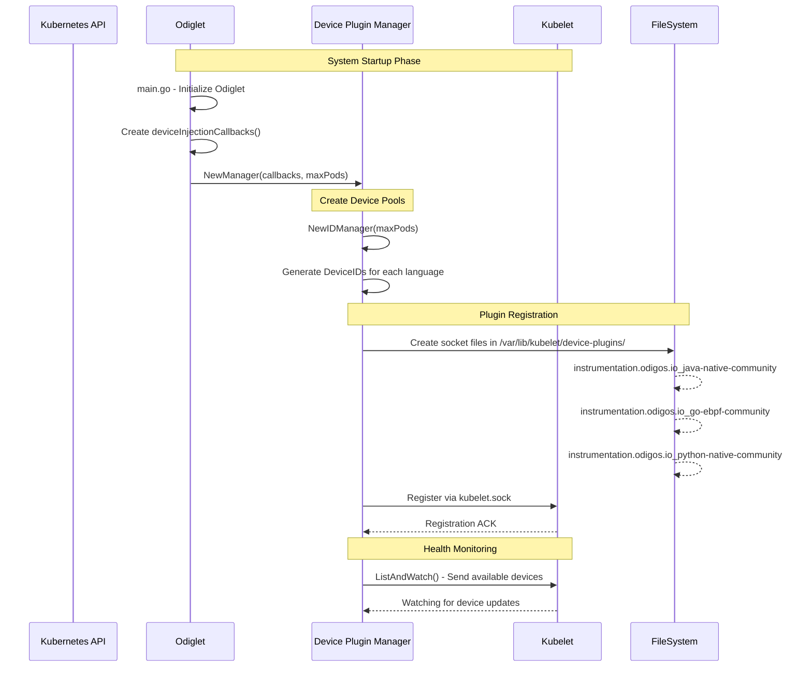
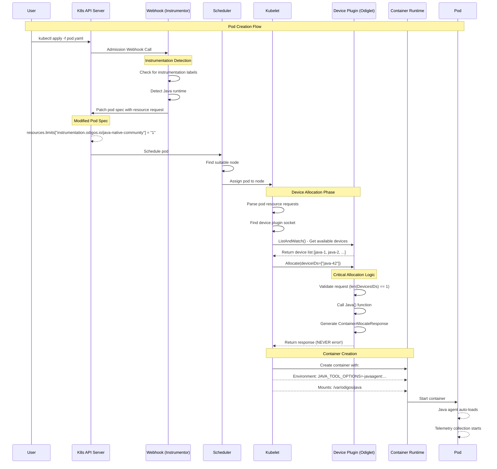
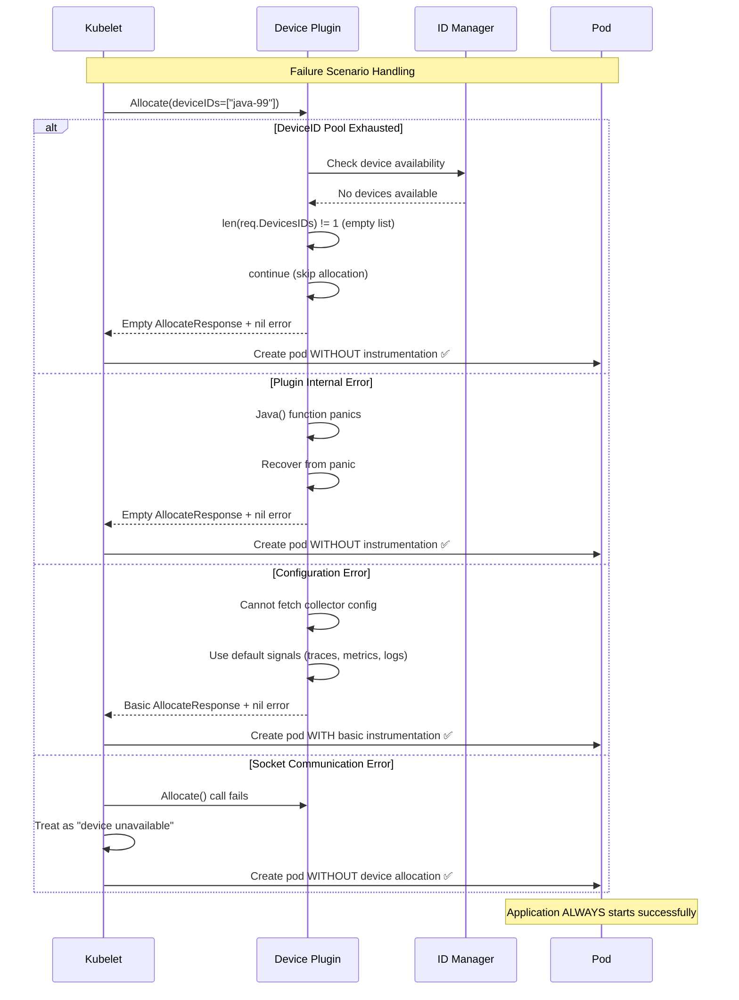
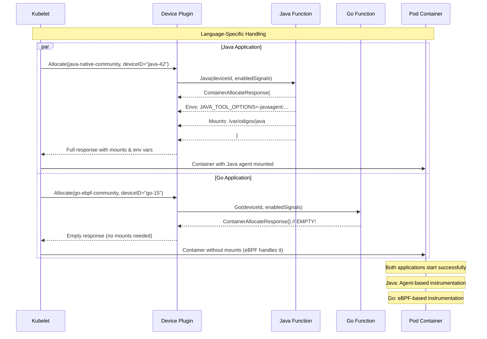
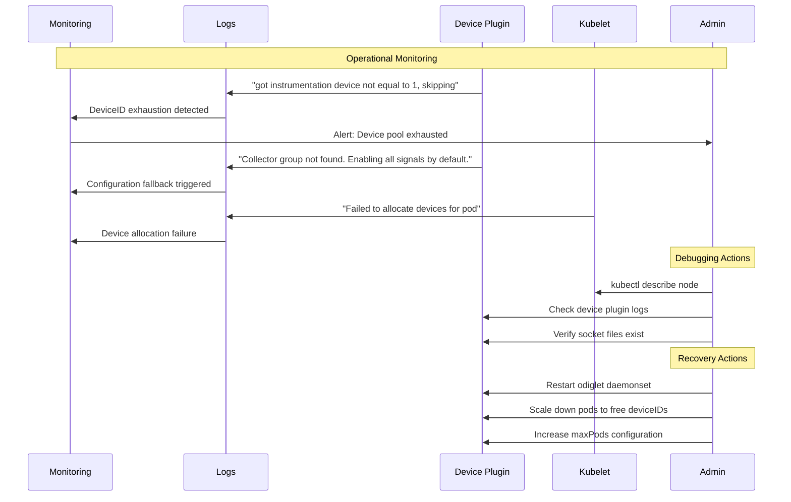

# Odigos Device Injection Flow & Fail-Safe Behavior Analysis

## Table of Contents
1. [Overview](#overview)
2. [Architecture Components](#architecture-components)
3. [Complete Flow Analysis](#complete-flow-analysis)
4. [Sequence Diagrams](#sequence-diagrams)
5. [Fail-Safe Behavior](#fail-safe-behavior)
6. [Language-Specific Behaviors](#language-specific-behaviors)
7. [Error Scenarios](#error-scenarios)
8. [Monitoring & Debugging](#monitoring--debugging)
9. [Key Takeaways](#key-takeaways)

## Overview

Odigos implements a Kubernetes-native observability injection system using the standard Device Plugin API. The system prioritizes **application availability over instrumentation completeness** through a comprehensive fail-safe design.

### Core Philosophy
> "Better to have a running application without observability than no application at all"

## Architecture Components

### 1. Device Plugin System
- **Purpose**: Leverages Kubernetes Device Plugin API for instrumentation injection
- **Location**: `/var/lib/kubelet/device-plugins/`
- **Communication**: Unix sockets + gRPC

### 2. Key Components
```
┌─────────────────┐    ┌──────────────────┐    ┌─────────────────┐
│   Odiglet       │    │ Device Plugins   │    │    Kubelet      │
│                 │    │                  │    │                 │
│ • Main Process  │◄──►│ • Java Plugin    │◄──►│ • Scheduler     │
│ • Device Mgr    │    │ • Go Plugin      │    │ • Allocator     │
│ • Callbacks     │    │ • Python Plugin  │    │ • Runtime       │
└─────────────────┘    └──────────────────┘    └─────────────────┘
```

### 3. Device Terminology
- **Device** = Language SDK capability (not physical hardware)
- **DeviceID** = Unique identifier for tracking instrumentation
- **Plugin** = Language-specific allocation logic

## Complete Flow Analysis

### Phase 1: System Initialization

#### A. Odiglet Startup
```go
// main.go
func main() {
    o, err := odiglet.New(deviceInjectionCallbacks(), ebpfInstrumentationFactories())
    o.Run(ctx)
}

func deviceInjectionCallbacks() instrumentation.OtelSdksLsf {
    return map[common.ProgrammingLanguage]map[common.OtelSdk]instrumentation.LangSpecificFunc{
        common.JavaProgrammingLanguage: {
            common.OtelSdkNativeCommunity: instrumentlang.Java,
        },
        common.GoProgrammingLanguage: {
            common.OtelSdkEbpfCommunity: instrumentlang.Go,
        },
        // ... other languages
    }
}
```

#### B. Device Pool Creation
```go
// Creates device pools based on node capacity
func NewIDManager(initialSize int64) *IDManager {
    for i := int64(0); i < initialSize; i++ {
        m.devices[i] = uuid.New().String() // e.g., "java-42", "go-15"
    }
}
```

#### C. Plugin Registration
- Creates sockets: `instrumentation.odigos.io_java-native-community`
- Registers with Kubelet via `kubelet.sock`
- Each language gets its own plugin instance

### Phase 2: Pod Creation Sequence

```
User Request → API Server → Webhook → Scheduler → Kubelet → Device Plugin → Container Runtime
```

#### Step 1: Webhook Interception
```go
// pods_webhook.go
func (p *PodsWebhook) Default(ctx context.Context, obj runtime.Object) error {
    // Adds resource requests to pod spec
    resources:
      limits:
        instrumentation.odigos.io/java-native-community: "1"
}
```

#### Step 2: Kubelet Processing
1. **Resource Detection**: Kubelet scans pod spec for `instrumentation.odigos.io/*`
2. **Plugin Discovery**: Checks `/var/lib/kubelet/device-plugins/` for matching socket
3. **Device Listing**: Calls `ListAndWatch()` to get available devices
4. **Device Allocation**: Calls `Allocate()` with specific deviceIDs

#### Step 3: Device Allocation
```go
// plugin.go - THE CRITICAL FUNCTION
func (p *plugin) Allocate(ctx context.Context, request *v1beta1.AllocateRequest) (*v1beta1.AllocateResponse, error) {
    res := &v1beta1.AllocateResponse{}
    
    // FAIL-SAFE: Never return error
    // "If the Allocate returns an error, the pod will not be scheduled which we have to avoid no matter what."
    
    for _, req := range request.ContainerRequests {
        if len(req.DevicesIDs) != 1 {
            continue // SKIP instead of FAIL
        }
        
        deviceId := req.DevicesIDs[0]
        res.ContainerResponses = append(res.ContainerResponses, p.LangSpecificFunc(deviceId, enabledSignals))
    }
    
    return res, nil // ALWAYS returns nil error
}
```

## Sequence Diagrams

### 1. System Initialization Sequence



### 2. Pod Creation & Instrumentation Sequence



### 3. Fail-Safe Behavior Sequence



### 4. Language-Specific Allocation Sequence



### 5. Error Recovery & Monitoring Sequence



## Fail-Safe Behavior

### 1. Core Fail-Safe Mechanisms

#### A. Never Return Errors
```go
return res, nil  // ALWAYS nil error, regardless of internal failures
```

#### B. Skip Invalid Requests
```go
if len(req.DevicesIDs) != 1 {
    continue  // Skip malformed requests instead of failing
}
```

#### C. Graceful Configuration Fallback
```go
if err != nil {
    // Use default signals instead of failing
    enabledSignals[common.TracesObservabilitySignal] = struct{}{}
    enabledSignals[common.MetricsObservabilitySignal] = struct{}{}
    enabledSignals[common.LogsObservabilitySignal] = struct{}{}
}
```

### 2. Failure Scenarios & Responses

| Scenario | Odigos Response | Pod Outcome |
|----------|----------------|-------------|
| DeviceID Pool Exhausted | Returns empty response | ✅ Pod created, uninstrumented |
| Plugin Socket Missing | Kubelet skips allocation | ✅ Pod created, uninstrumented |
| Collector Config Error | Uses default configuration | ✅ Pod created, basic instrumentation |
| Network/API Failures | Falls back to defaults | ✅ Pod created, basic instrumentation |
| Language Function Panic | Returns empty response | ✅ Pod created, uninstrumented |

### 3. Fail-Safe Flow Diagram

```
Pod Creation Request
        ↓
   Webhook Processing
        ↓
   Resource Request Added? ──No──→ Normal Pod Creation ✅
        ↓ Yes
   Kubelet Finds Plugin? ──No──→ Pod Without Device ✅
        ↓ Yes
   DeviceIDs Available? ──No──→ Empty Response → Uninstrumented Pod ✅
        ↓ Yes
   Allocation Success? ──No──→ Empty Response → Uninstrumented Pod ✅
        ↓ Yes
   Instrumented Pod ✅
```

## Language-Specific Behaviors

### Java Language
```go
func Java(deviceId string, signals map[common.ObservabilitySignal]struct{}) *v1beta1.ContainerAllocateResponse {
    return &v1beta1.ContainerAllocateResponse{
        Envs: map[string]string{
            "JAVA_TOOL_OPTIONS": "-javaagent:/var/odigos/java/ck-agent-universal.jar",
            "OTEL_EXPORTER_OTLP_ENDPOINT": "http://nodeIP:4317",
        },
        Mounts: []*v1beta1.Mount{
            {ContainerPath: "/var/odigos/java", HostPath: "/var/odigos/java"},
        },
    }
}
```
**Result**: Container gets Java agent mounted and configured

### Go Language
```go
func Go(deviceId string, signals map[common.ObservabilitySignal]struct{}) *v1beta1.ContainerAllocateResponse {
    return &v1beta1.ContainerAllocateResponse{} // ALWAYS EMPTY!
}
```
**Result**: Container gets deviceID for tracking, but no mounts (eBPF handles instrumentation)

### Python/Node.js Languages
Similar to Java but with language-specific agents and environment variables.

## Error Scenarios

### 1. DeviceID Pool Exhaustion
```
Scenario: Node has 110 max pods, all deviceIDs allocated
Request: New pod needs Java instrumentation
Response: Allocate() called with empty DevicesIDs
Result: Pod created without instrumentation
```

### 2. Plugin Crash/Restart
```
Scenario: Device plugin crashes during allocation
Request: Kubelet calls Allocate() on dead socket
Response: gRPC connection fails
Result: Kubelet treats as "device unavailable", pod created without device
```

### 3. Kubernetes API Unavailable
```
Scenario: Cannot fetch collector configuration
Request: Plugin tries to get CollectorsGroup
Response: API call fails, falls back to default signals
Result: Pod created with basic instrumentation
```

## Monitoring & Debugging

### 1. Key Log Patterns
```bash
# DeviceID exhaustion
"got instrumentation device not equal to 1, skipping"

# Configuration fallback
"Collector group not found. Enabling all signals by default."

# Plugin health issues
"Failed to send ListAndWatchResponse"
```

### 2. Health Checks
```bash
# Check device plugin registration
ls -la /var/lib/kubelet/device-plugins/ | grep instrumentation.odigos.io

# Verify pod instrumentation
kubectl exec POD_NAME -- env | grep -E "(JAVA_TOOL_OPTIONS|OTEL_)"

# Check resource allocation
kubectl describe node NODE_NAME | grep "instrumentation.odigos.io"
```

### 3. Debugging Commands
```bash
# Check pod resource requests
kubectl get pod POD_NAME -o yaml | grep -A5 resources:

# Monitor device plugin logs
kubectl logs daemonset/odiglet -n odigos-system | grep -i device

# Check kubelet device allocation
curl -k https://localhost:10250/api/v1/nodes/NODE_NAME/proxy/pods/
```

## Key Takeaways

### ✅ Fail-Safe Guarantees
1. **Pod creation NEVER fails due to Odigos**
2. **Applications always start (instrumented or not)**
3. **System degrades gracefully under pressure**
4. **No cascading failures from observability**

### ⚠️ Operational Considerations
1. **Monitor for uninstrumented pods**
2. **Set alerts for device pool exhaustion**
3. **Implement observability coverage metrics**
4. **Regular health checks on device plugins**

### 🎯 Design Benefits
- **Production Safety**: Zero risk to application availability
- **Operational Resilience**: Continues working during maintenance
- **Developer Confidence**: Teams trust Odigos won't break apps
- **Gradual Rollout**: Safe to deploy without service risk

### 🔍 Potential Risks
- **Silent Failures**: Missing observability without obvious alerts
- **Debugging Complexity**: Hard to determine why instrumentation failed
- **Resource Waste**: DeviceIDs allocated but not effectively used
- **Coverage Gaps**: Some services may run without telemetry

## Conclusion

Odigos implements a robust **fail-safe** architecture that prioritizes application availability over complete observability coverage. This design makes it a production-ready solution suitable for critical environments where service uptime is paramount.

The system's "fail-open" approach ensures that observability issues never impact business operations, while providing comprehensive mechanisms for monitoring and debugging instrumentation coverage.

---
*Document Version: 1.0*  
*Last Updated: 2024*  
*Author: Technical Analysis of Odigos Codebase* 