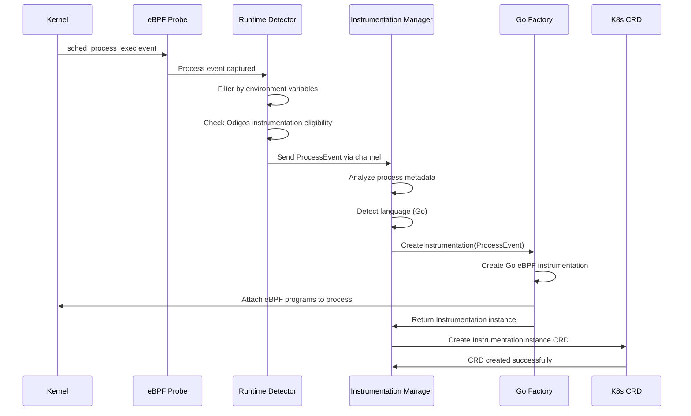
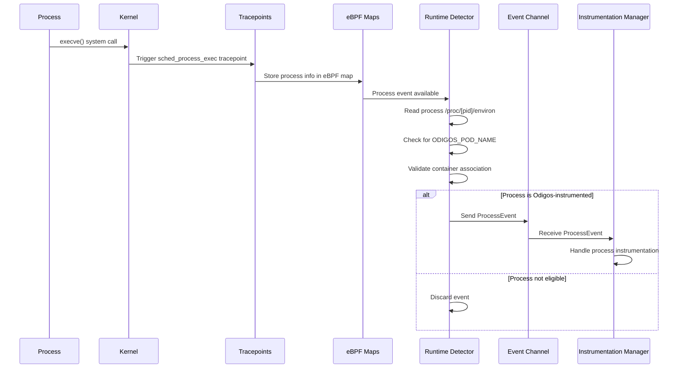
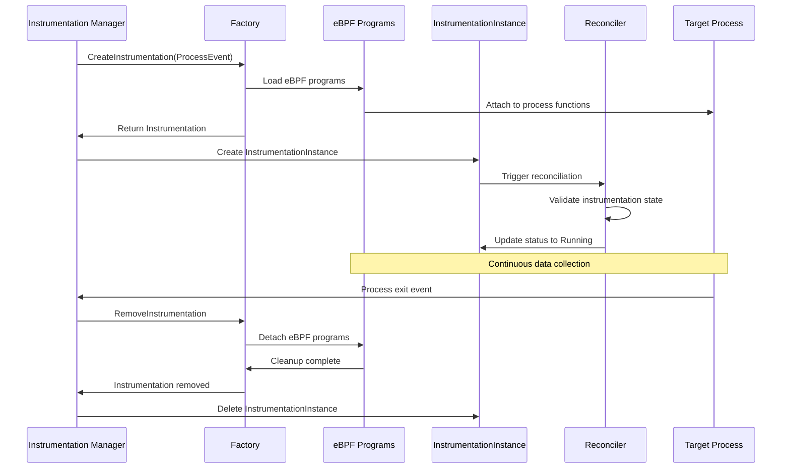
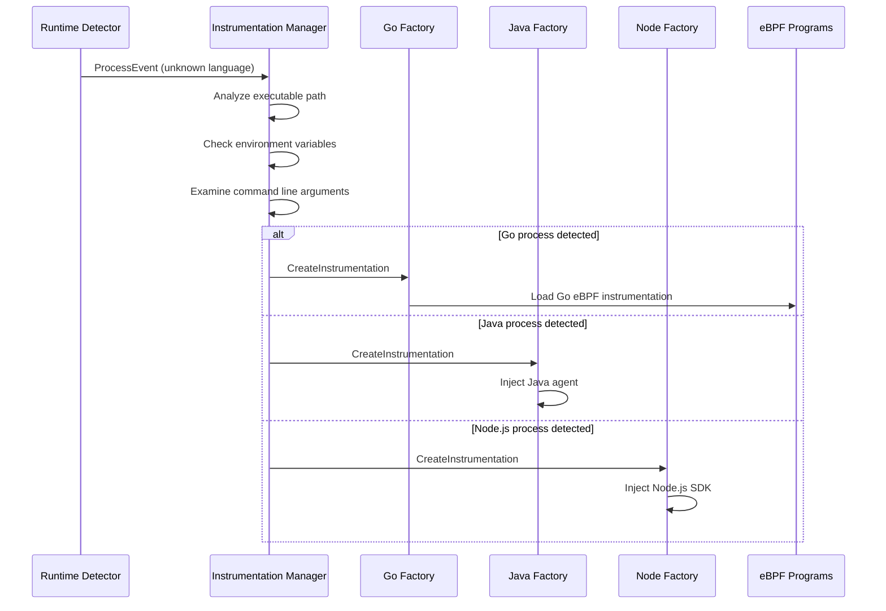

# Odigos eBPF Process Detection and Instrumentation Flow

## Executive Summary

Odigos uses a sophisticated eBPF-based system to automatically detect, monitor, and instrument processes running in Kubernetes pods. The system leverages kernel-level tracepoints to capture process lifecycle events and applies OpenTelemetry instrumentation based on detected runtime languages and frameworks.

## Architecture Overview

### Core Components

1. **Odiglet DaemonSet**: Runs on every Kubernetes node
2. **Runtime Detector**: eBPF-based process detection engine
3. **Instrumentation Manager**: Orchestrates instrumentation lifecycle
4. **Language-Specific Factories**: Create runtime-specific instrumentations
5. **eBPF Reconciler**: Manages eBPF instrumentation lifecycle

## Detailed Component Analysis

### 1. eBPF Process Detection Engine

#### Runtime Detector (`runtime-detector` package)

The runtime detector is the core eBPF component that monitors process events at the kernel level.

**Key Features:**
- Uses eBPF tracepoints to monitor process lifecycle
- Filters processes based on Odigos-specific criteria
- Sends filtered events through Go channels to the instrumentation manager

**eBPF Tracepoints Used:**
```c
// Kernel tracepoints monitored
- sched_process_exec    // Process execution
- sched_process_fork    // Process creation
- sched_process_exit    // Process termination
```

**Process Detection Flow:**
```go
type ProcessEvent struct {
    PID         int32
    PPID        int32
    ExecPath    string
    CmdLine     []string
    Env         map[string]string
    EventType   EventType // EXEC, FORK, EXIT
}
```

#### eBPF Kernel Integration

**Probe Attachment:**
```go
// probe.go - eBPF probe management
func (p *Probe) Attach() error {
    // Attach to kernel tracepoints
    // Monitor sched_process_exec, sched_process_fork, sched_process_exit
    // Set up eBPF maps for process tracking
}
```

**Event Filtering Logic:**
1. **Initial Process Scan**: Scans `/proc` filesystem for existing processes
2. **Real-time Monitoring**: Uses eBPF to capture new process events
3. **Environment Variable Filtering**: Checks for Odigos-specific environment variables
4. **Language Detection**: Analyzes process metadata to determine runtime language

### 2. Odiglet Detector Integration

#### Detector Configuration (`odiglet/pkg/detector/detector.go`)

```go
// Environment variables monitored for Odigos instrumentation
var envVarsToMonitor = []string{
    "NODE_VERSION",
    "PYTHON_VERSION", 
    "JAVA_VERSION",
    "DOTNET_VERSION",
    "ODIGOS_POD_NAME",
    "ODIGOS_CONTAINER_NAME",
    // ... other Odigos-specific variables
}
```

#### Process Filtering Logic

**Odigos-Specific Filtering:**
1. **Environment Variable Check**: Processes must have Odigos environment variables
2. **Pod Association**: Links processes to specific Kubernetes pods
3. **Container Mapping**: Associates processes with container instances
4. **Language Runtime Detection**: Identifies programming language and framework

```go
func (d *Detector) isOdigosInstrumented(proc *ProcessInfo) bool {
    // Check for ODIGOS_POD_NAME environment variable
    // Verify container association
    // Validate instrumentation eligibility
}
```

### 3. Event-Based Communication Architecture

#### Channel-Based Event Flow

```go
// Process event channel communication
type ProcessEventChannel chan ProcessEvent

// Event types
const (
    PROCESS_EXEC EventType = iota
    PROCESS_FORK
    PROCESS_EXIT
)
```

**Event Flow:**
1. **eBPF Kernel Events** → **Runtime Detector**
2. **Runtime Detector** → **Process Event Channel**
3. **Process Event Channel** → **Instrumentation Manager**
4. **Instrumentation Manager** → **Language-Specific Factories**

### 4. Instrumentation Manager (`instrumentation/manager.go`)

#### Core Responsibilities

```go
type InstrumentationManager struct {
    processEvents    chan ProcessEvent
    factories        map[OtelDistribution]Factory
    activeInstruments map[int32]Instrumentation
}
```

**Process Handling Flow:**
```go
func (m *Manager) handleProcess(event ProcessEvent) error {
    switch event.EventType {
    case PROCESS_EXEC:
        return m.createInstrumentation(event)
    case PROCESS_EXIT:
        return m.removeInstrumentation(event.PID)
    }
}
```

#### Language Detection and Factory Selection

**Detection Logic:**
1. **Process Analysis**: Examines executable path and command line
2. **Environment Inspection**: Checks language-specific environment variables
3. **Runtime Identification**: Determines specific language version and framework
4. **Factory Selection**: Chooses appropriate instrumentation factory

```go
func (m *Manager) detectLanguage(proc ProcessEvent) (Language, OtelDistribution) {
    // Analyze process metadata
    // Check for language-specific indicators
    // Return detected language and OTel distribution
}
```

### 5. Language-Specific Instrumentation Factories

#### Go Instrumentation Factory (`odiglet/pkg/ebpf/sdks/go.go`)

```go
type GoInstrumentationFactory struct {
    ebpfSDK *GoEbpfSDK
}

func (f *GoInstrumentationFactory) CreateInstrumentation(proc ProcessEvent) (Instrumentation, error) {
    // Create Go-specific eBPF instrumentation
    // Attach to Go runtime functions
    // Set up OpenTelemetry data collection
}
```

**Go-Specific eBPF Instrumentation:**
- **Function Tracing**: Instruments Go function calls
- **HTTP Request Tracking**: Monitors HTTP client/server operations
- **Database Query Instrumentation**: Tracks database interactions
- **gRPC Call Monitoring**: Instruments gRPC communications

#### Factory Pattern Implementation

```go
type Factory interface {
    CreateInstrumentation(ProcessEvent) (Instrumentation, error)
    SupportsLanguage(Language) bool
    GetOtelDistribution() OtelDistribution
}

// Factory registry
var Factories = map[OtelDistribution]Factory{
    GoOtelEbpf:     &GoInstrumentationFactory{},
    JavaOtelAgent:  &JavaInstrumentationFactory{},
    NodeOtelSDK:    &NodeInstrumentationFactory{},
    // ... other language factories
}
```

### 6. Instrumentation eBPF Reconciler

#### Purpose and Functionality

The instrumentation eBPF reconciler manages the lifecycle of eBPF-based instrumentations:

**Key Responsibilities:**
1. **CRD Management**: Manages InstrumentationInstance Custom Resource Definitions
2. **eBPF Lifecycle**: Handles loading, running, and cleanup of eBPF programs
3. **Resource Tracking**: Monitors instrumentation resource usage
4. **Error Handling**: Manages instrumentation failures and recovery

```go
type InstrumentationEbpfReconciler struct {
    client.Client
    Scheme *runtime.Scheme
    ebpfManager *EbpfManager
}

func (r *InstrumentationEbpfReconciler) Reconcile(ctx context.Context, req ctrl.Request) (ctrl.Result, error) {
    // Fetch InstrumentationInstance CRD
    // Determine desired state
    // Apply eBPF instrumentation changes
    // Update status and handle errors
}
```

#### CRD Integration

**InstrumentationInstance CRD:**
```yaml
apiVersion: odigos.io/v1alpha1
kind: InstrumentationInstance
metadata:
  name: go-app-instrumentation
spec:
  processId: 12345
  language: go
  otelDistribution: ebpf
  instrumentationLibraries:
    - name: http
      version: v1.0.0
status:
  phase: Running
  conditions:
    - type: Ready
      status: "True"
```

### 7. Complete Process Flow

#### Initialization Phase

1. **Odiglet Startup**: DaemonSet pods start on each node
2. **eBPF Probe Loading**: Runtime detector loads eBPF programs
3. **Tracepoint Attachment**: eBPF programs attach to kernel tracepoints
4. **Initial Process Scan**: Scans existing processes in `/proc`
5. **Manager Initialization**: Starts instrumentation manager with event channels

#### Runtime Detection Phase

1. **Kernel Event Capture**: eBPF tracepoints capture process events
2. **Event Filtering**: Runtime detector filters events based on criteria
3. **Environment Analysis**: Checks for Odigos-specific environment variables
4. **Process Validation**: Validates process eligibility for instrumentation
5. **Event Transmission**: Sends filtered events through Go channels

#### Instrumentation Phase

1. **Event Reception**: Instrumentation manager receives process events
2. **Language Detection**: Analyzes process to determine runtime language
3. **Factory Selection**: Chooses appropriate instrumentation factory
4. **Instrumentation Creation**: Factory creates language-specific instrumentation
5. **eBPF Attachment**: Attaches instrumentation eBPF programs to target process
6. **CRD Creation**: Creates InstrumentationInstance CRD for tracking

#### Monitoring and Lifecycle Management

1. **Continuous Monitoring**: Tracks instrumented process health
2. **Data Collection**: Collects OpenTelemetry data from instrumented processes
3. **Resource Management**: Monitors and manages eBPF resource usage
4. **Cleanup Handling**: Removes instrumentation when processes exit
5. **Error Recovery**: Handles instrumentation failures and recovery

## Sequence Diagrams

### 1. Process Detection and Initial Instrumentation



### 2. eBPF Event Flow and Filtering



### 3. Instrumentation Lifecycle Management



### 4. Multi-Language Detection and Factory Selection



## Key Technical Details

### eBPF Implementation Specifics

1. **Kernel Compatibility**: Supports Linux kernels 4.18+
2. **Memory Management**: Uses eBPF maps for efficient data sharing
3. **Performance Optimization**: Minimal overhead through selective instrumentation
4. **Security**: Runs in kernel space with appropriate permissions

### Process Filtering Criteria

1. **Environment Variables**: Must contain `ODIGOS_POD_NAME`
2. **Container Association**: Must be associated with a Kubernetes container
3. **Language Detection**: Must be a supported runtime language
4. **Instrumentation Eligibility**: Must not already be instrumented

### Error Handling and Recovery

1. **eBPF Load Failures**: Automatic retry with exponential backoff
2. **Process Exit Handling**: Graceful cleanup of instrumentation resources
3. **CRD Synchronization**: Ensures consistency between actual and desired state
4. **Resource Limits**: Prevents excessive eBPF program loading

## Performance Considerations

### eBPF Overhead

- **CPU Impact**: < 1% overhead for typical workloads
- **Memory Usage**: Minimal kernel memory footprint
- **Network Impact**: No additional network overhead for detection

### Scalability

- **Process Limit**: Can handle thousands of processes per node
- **Event Rate**: Supports high-frequency process creation/destruction
- **Resource Efficiency**: Optimized for large-scale Kubernetes deployments

## Security Implications

### Kernel Access

- **Privileged Operations**: Requires CAP_SYS_ADMIN capability
- **eBPF Verification**: All eBPF programs undergo kernel verification
- **Isolation**: Process instrumentation is isolated per container

### Data Privacy

- **Environment Variables**: Only reads Odigos-specific variables
- **Process Metadata**: Minimal process information collection
- **Data Transmission**: Secure channel communication within node

## Conclusion

The Odigos eBPF process detection and instrumentation system provides a comprehensive, efficient, and secure solution for automatic OpenTelemetry instrumentation in Kubernetes environments. The system's architecture ensures minimal performance impact while providing robust process monitoring and instrumentation capabilities across multiple programming languages and frameworks.

The event-driven architecture, combined with eBPF's kernel-level efficiency, enables real-time process detection and instrumentation without requiring application code changes or container image modifications. The modular factory pattern allows for easy extension to support additional programming languages and instrumentation strategies. 