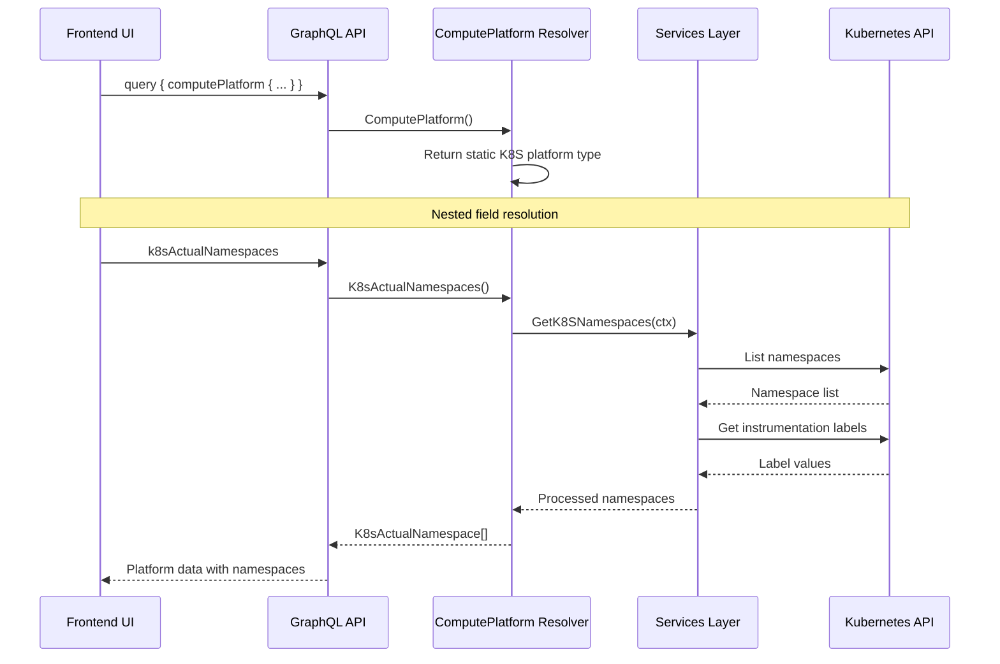
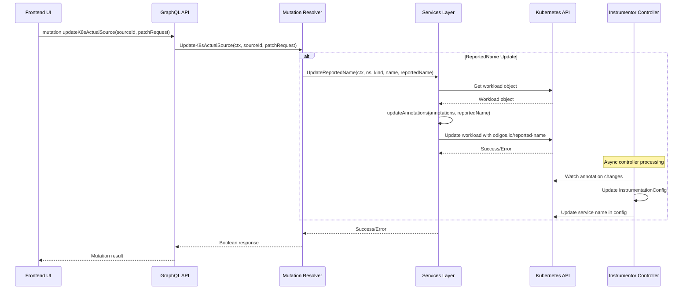
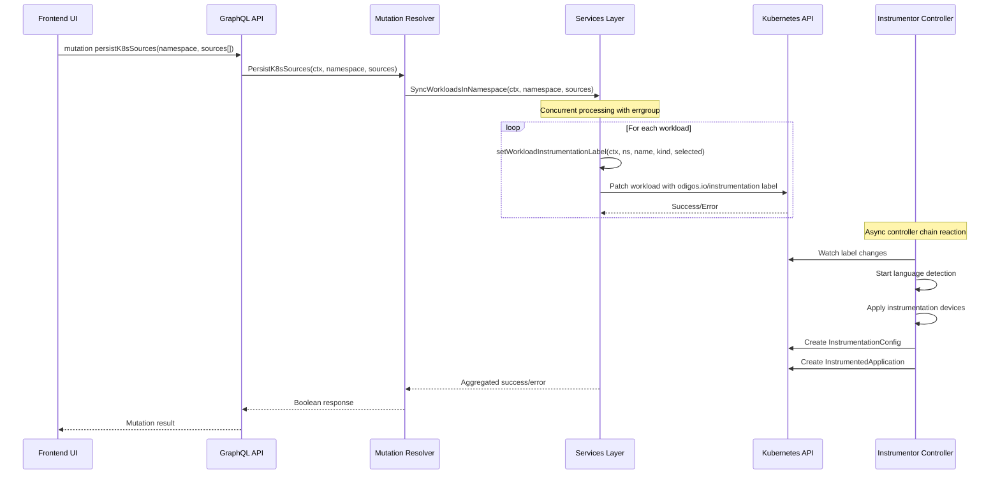
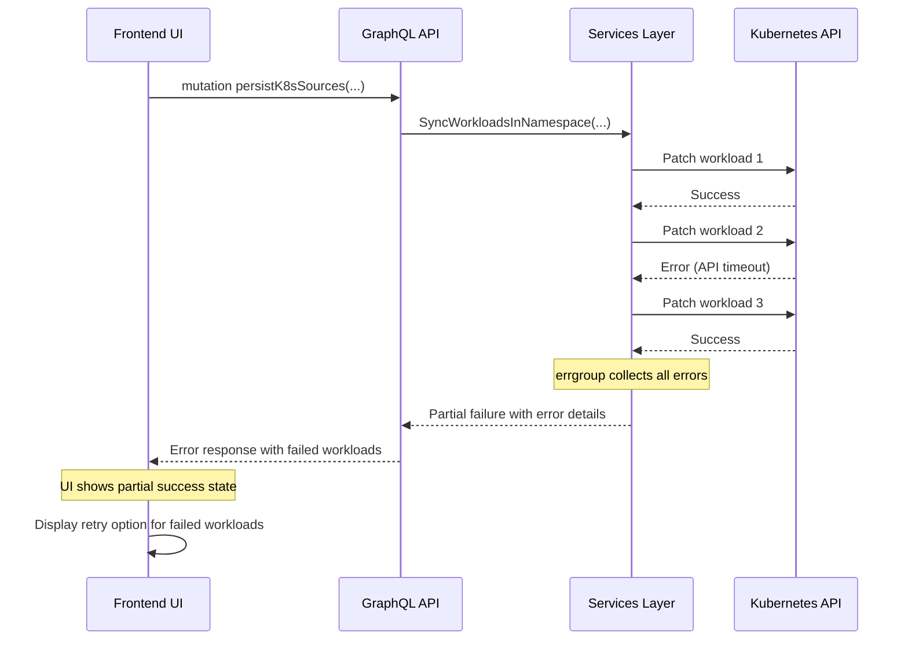
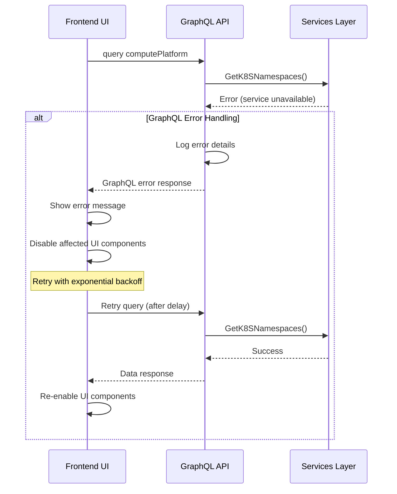
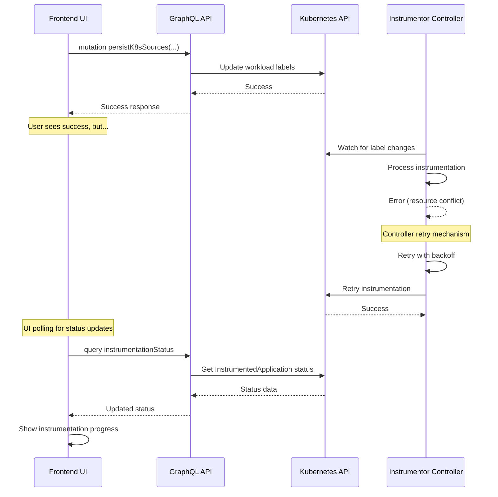
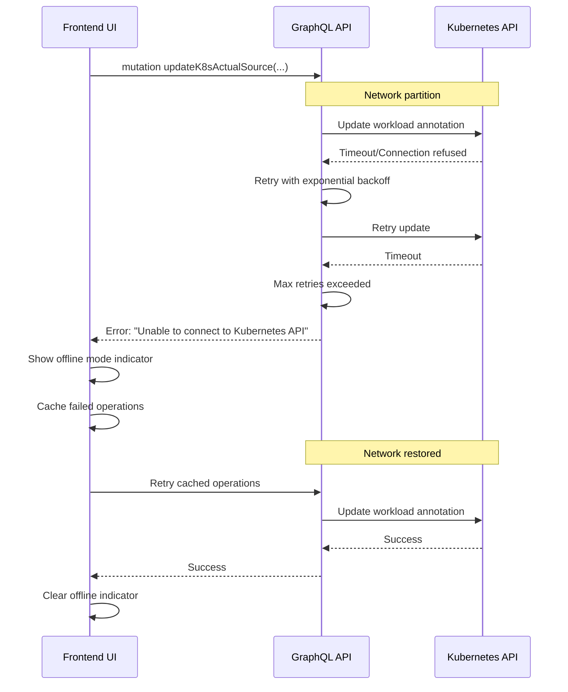
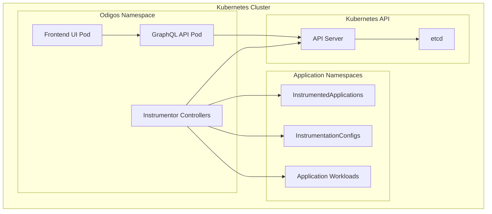

# Frontend UI Architecture Summary

## Overview

The Odigos frontend is a GraphQL-based web application that provides a user interface for managing observability instrumentation in Kubernetes clusters. It follows a modern architecture with React/TypeScript frontend, GraphQL API layer, and direct Kubernetes integration.

## Architecture Components

### 1. **Frontend Layer (Web UI)**
- **Technology**: React/TypeScript (assumed based on modern web practices)
- **Communication**: GraphQL queries and mutations
- **State Management**: Apollo Client for GraphQL state management
- **Responsibilities**:
  - User interface for source management
  - Destination configuration
  - Instrumentation rule management
  - Real-time status monitoring

### 2. **GraphQL API Layer**
- **Framework**: gqlgen (Go GraphQL library)
- **Files**: 
  - `graph/schema.graphqls` - GraphQL schema definition
  - `graph/schema.resolvers.go` - Resolver implementations
  - `graph/generated.go` - Auto-generated GraphQL code
- **Responsibilities**:
  - API contract definition
  - Request validation and processing
  - Business logic orchestration

### 3. **Services Layer**
- **Files**:
  - `services/sources.go` - Source management
  - `services/namespaces.go` - Namespace operations
  - `services/instrumentationrule.go` - Rule management
  - `services/utils.go` - Utility functions
- **Responsibilities**:
  - Business logic implementation
  - Data transformation
  - Kubernetes API interactions

### 4. **Kubernetes Integration Layer**
- **Files**:
  - `kube/client.go` - Kubernetes client wrapper
- **Responsibilities**:
  - Kubernetes API communication
  - Resource management
  - Authentication and authorization

## Key Operations Flow

### 1. GetComputePlatform Operation



### 2. UpdateK8sActualSource Operation



### 3. PersistK8sSources Operation



## Error Handling and Failover Scenarios

### 1. **Kubernetes API Failures**



**Failover Strategy:**
- **Concurrent Processing**: Uses `errgroup` to process workloads in parallel
- **Partial Success Handling**: Continues processing even if some workloads fail
- **Error Aggregation**: Collects and reports all errors to the user
- **Retry Mechanism**: UI can retry failed operations

### 2. **GraphQL Layer Failures**



**Failover Strategy:**
- **Error Boundaries**: GraphQL errors are caught and handled gracefully
- **Graceful Degradation**: UI components disable when data is unavailable
- **Automatic Retry**: Exponential backoff retry mechanism
- **User Feedback**: Clear error messages and loading states

### 3. **Controller Synchronization Failures**



**Failover Strategy:**
- **Eventual Consistency**: Controllers use Kubernetes retry mechanisms
- **Status Polling**: UI polls for status updates to show progress
- **Reconciliation**: Controllers continuously reconcile desired vs actual state
- **Health Monitoring**: UI shows instrumentation health and progress

### 4. **Network Connectivity Issues**



**Failover Strategy:**
- **Connection Pooling**: Kubernetes client uses connection pooling
- **Retry Logic**: Exponential backoff with jitter
- **Offline Mode**: UI caches operations when backend is unavailable
- **Health Checks**: Regular health checks to detect connectivity issues

## Performance Optimizations

### 1. **Concurrent Processing**
```go
// Example from services/namespaces.go
func SyncWorkloadsInNamespace(ctx context.Context, nsName string, workloads []model.PersistNamespaceSourceInput) error {
    g, ctx := errgroup.WithContext(ctx)
    g.SetLimit(kube.K8sClientDefaultBurst) // Limit: 100 concurrent operations
    
    for _, workload := range workloads {
        currWorkload := workload
        g.Go(func() error {
            return setWorkloadInstrumentationLabel(ctx, nsName, currWorkload.Name, WorkloadKind(currWorkload.Kind.String()), currWorkload.Selected)
        })
    }
    return g.Wait()
}
```

### 2. **Kubernetes Client Configuration**
```go
// From kube/client.go
const (
    K8sClientDefaultQPS   = 100  // Queries per second
    K8sClientDefaultBurst = 100  // Burst capacity
)
```

### 3. **GraphQL Field Resolution**
- **Lazy Loading**: Fields are resolved only when requested
- **Batching**: Multiple operations can be batched in a single request
- **Caching**: Apollo Client provides automatic caching

## Security Considerations

### 1. **Authentication & Authorization**
- **RBAC**: Kubernetes RBAC controls API access
- **Service Account**: Frontend uses Kubernetes service account
- **Context Isolation**: Operations are scoped to accessible namespaces

### 2. **Input Validation**
- **GraphQL Schema**: Enforces type safety and required fields
- **Business Logic**: Services layer validates business rules
- **Kubernetes Validation**: API server validates resource specifications

### 3. **Error Information Disclosure**
- **Sanitized Errors**: Internal errors are logged but not exposed to UI
- **User-Friendly Messages**: Clear, actionable error messages
- **Audit Logging**: All operations are logged for security auditing

## Monitoring and Observability

### 1. **Health Checks**
- **Kubernetes API**: Regular health checks to Kubernetes API
- **GraphQL Endpoint**: Health check endpoint for load balancers
- **Controller Status**: Monitor controller reconciliation loops

### 2. **Metrics**
- **Operation Latency**: Track GraphQL operation response times
- **Error Rates**: Monitor error rates by operation type
- **Resource Usage**: Track memory and CPU usage

### 3. **Logging**
- **Structured Logging**: JSON-formatted logs with correlation IDs
- **Error Tracking**: Detailed error logs with stack traces
- **Audit Trail**: Log all user operations for compliance

## Deployment Architecture



## Best Practices

### 1. **Error Handling**
- Always provide meaningful error messages to users
- Implement retry logic with exponential backoff
- Use circuit breakers for external dependencies
- Log errors with sufficient context for debugging

### 2. **Performance**
- Use concurrent processing for bulk operations
- Implement proper pagination for large datasets
- Cache frequently accessed data
- Monitor and optimize slow GraphQL queries

### 3. **User Experience**
- Provide immediate feedback for user actions
- Show loading states during operations
- Implement optimistic updates where appropriate
- Gracefully handle partial failures

### 4. **Reliability**
- Design for eventual consistency
- Implement idempotent operations
- Use health checks and readiness probes
- Plan for graceful degradation scenarios

This architecture provides a robust, scalable, and user-friendly interface for managing Kubernetes observability instrumentation while handling various failure scenarios gracefully. 