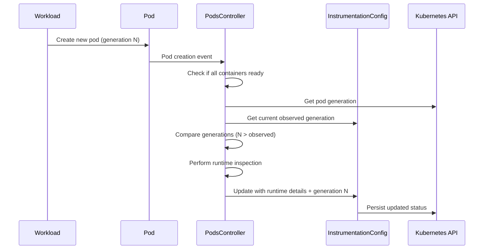
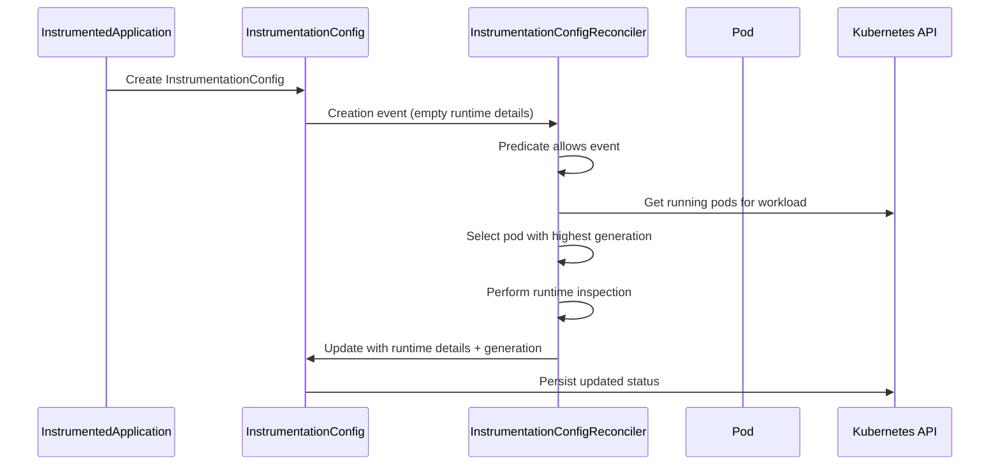
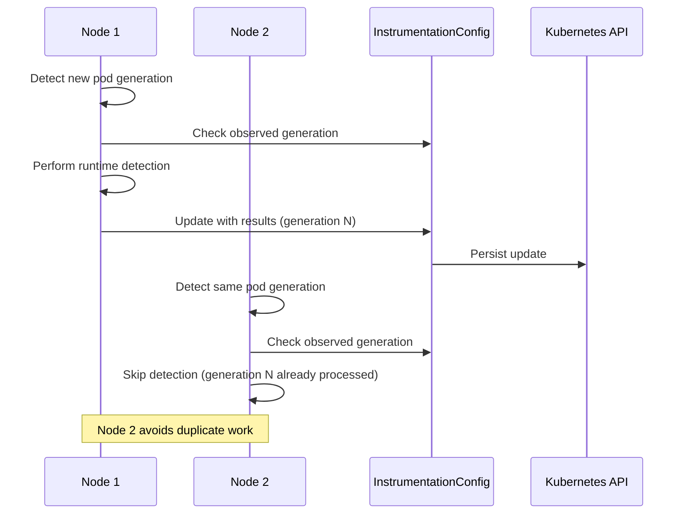
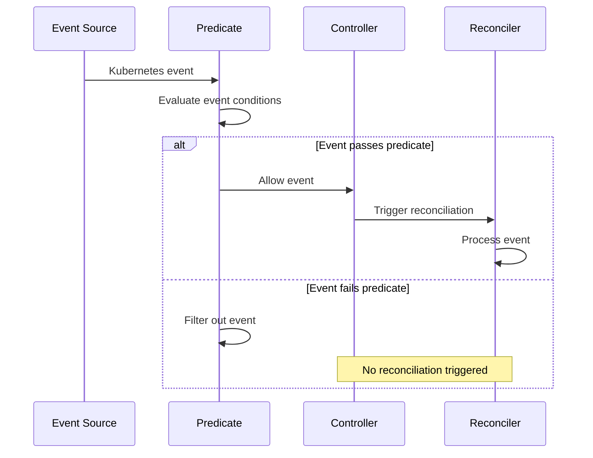

# Predicate Filtering and Pod Generation Logic in Odigos

## Table of Contents
1. [Overview](#overview)
2. [Pod Generation Logic](#pod-generation-logic)
3. [Dual Controller Generation Checks](#dual-controller-generation-checks)
4. [Predicate Filtering System](#predicate-filtering-system)
5. [Cross-Node Behavior](#cross-node-behavior)
6. [Sequence Diagrams](#sequence-diagrams)
7. [Implementation Details](#implementation-details)
8. [Best Practices](#best-practices)

## Overview

Odigos uses a sophisticated system of predicate filtering and pod generation tracking to efficiently manage runtime detection across Kubernetes clusters. This system ensures that:

- Runtime detection happens only when necessary
- Duplicate processing is avoided across multiple nodes
- Resources are used efficiently
- Race conditions are minimized

## Pod Generation Logic

### What is Pod Generation?

Pod generation is a mechanism to track when a workload (Deployment, StatefulSet, DaemonSet) has been updated. It's stored as metadata in the pod and increases each time the workload specification changes.

### Key Components

1. **Generation Tracking**: Each pod has a generation number that reflects the workload's current version
2. **Observed Generation**: InstrumentationConfig stores the last processed generation
3. **Comparison Logic**: Controllers compare current vs. observed generation to decide if processing is needed

### Generation Flow

```
Workload Update → New Pod Generation → Runtime Detection → Update InstrumentationConfig
```

## Dual Controller Generation Checks

### Why Two Controllers Check Pod Generation?

Odigos uses **two different controllers** that both check pod generation, but they serve different purposes and trigger under different conditions. This dual approach ensures comprehensive coverage while maintaining efficiency.

### Controller Comparison

| Aspect | PodsController | InstrumentationConfigReconciler |
|--------|----------------|--------------------------------|
| **Watches** | `corev1.Pod` | `odigosv1.InstrumentationConfig` |
| **Predicate** | `AllContainersReadyPredicate` | `instrumentationConfigPredicate` |
| **Trigger Condition** | Pod containers become ready | New InstrumentationConfig with empty runtime details |
| **Generation Check Frequency** | Every pod ready event | Only when config is created/empty |
| **Pod Selection** | Single pod (the one that triggered) | Best pod (highest generation from all running pods) |

### Detailed Controller Behavior

#### 1. PodsController
```go
// Setup
WithEventFilter(&odigospredicate.AllContainersReadyPredicate{})

// Reconcile Logic
podGeneration, err := GetPodGeneration(ctx, p.Clientset, &pod)
isNewPodGeneration := podGeneration > instrumentationConfig.Status.ObservedWorkloadGeneration
instrumentedConfigContainUnknown := InstrumentationConfigContainsUnknownLanguage(instrumentationConfig)

shouldSkipDetection := failedToGetPodGeneration || (!isNewPodGeneration && !instrumentedConfigContainUnknown)
```

**Characteristics:**
- **Reactive**: Responds to pod lifecycle events
- **Frequent**: Triggers every time a pod becomes ready
- **Fast Skip**: Uses generation comparison to avoid redundant work
- **Single Pod Focus**: Processes the specific pod that triggered the event

#### 2. InstrumentationConfigReconciler
```go
// Setup
WithEventFilter(&instrumentationConfigPredicate{})

// Predicate Logic
func (p *instrumentationConfigPredicate) Create(e event.CreateEvent) bool {
    obj, ok := e.Object.(*odigosv1.InstrumentationConfig)
    return len(obj.Status.RuntimeDetailsByContainer) == 0
}

// Reconcile Logic
for i := range pods {
    podGeneration, err := GetPodGeneration(ctx, r.Clientset, podPtr)
    if podGeneration > instrumentationConfig.Status.ObservedWorkloadGeneration && 
       podGeneration > selectedPodGeneration {
        selectedPodGeneration = podGeneration
        selectedPodForInspection = podPtr
    }
}
```

**Characteristics:**
- **Proactive**: Responds to InstrumentationConfig creation
- **Infrequent**: Triggers only for new/empty configs
- **Comprehensive**: Examines all running pods to find the best candidate
- **One-time**: Never triggers again after runtime details are populated

### Scenarios and Controller Interactions

#### Scenario 1: New Workload Deployment
```
Timeline:
T1: Workload deployed → InstrumentationConfig created (empty)
T2: InstrumentationConfigReconciler triggers
    → Finds running pods → Selects highest generation → Performs detection
T3: Pods become ready → PodsController triggers
    → Checks generation → Already processed → Skips
```

#### Scenario 2: Workload Update (New Generation)
```
Timeline:
T1: Deployment updated → New generation (N)
T2: New pods created with generation N
T3: Pod becomes ready → PodsController triggers
    → Checks: generation N > observed generation (N-1) ✅
    → Performs runtime detection → Updates observed generation to N
T4: More pods become ready → PodsController triggers
    → Checks: generation N > observed generation N ❌
    → Skips detection
```

#### Scenario 3: Odiglet Restart
```
Timeline:
T1: Odiglet restarts → Controllers start
T2: Cache warm-up → All objects loaded
T3: PodsController sees all ready pods
    → Checks generations → Most already processed → Skips
T4: InstrumentationConfigReconciler sees configs
    → Predicate blocks configs with runtime details
    → Only processes truly empty configs
```

#### Scenario 4: Unknown Language Re-detection
```
Timeline:
T1: Runtime detection finds unknown language
T2: Pod becomes ready → PodsController triggers
T3: Checks: generation same BUT unknown language detected ✅
    → Re-performs runtime detection
    → Attempts to identify previously unknown language
```

### Generation Check Frequency Analysis

#### PodsController Generation Checks:
- ✅ **Every pod ready event** (high frequency)
- ✅ **Controller restart** (all ready pods)
- ✅ **Workload updates** (new generations)
- ❌ **Efficiently skipped** when generation ≤ observed

#### InstrumentationConfigReconciler Generation Checks:
- ✅ **InstrumentationConfig creation** (low frequency)
- ✅ **Controller restart** (only empty configs)
- ❌ **Never for populated configs** (predicate blocks)
- ❌ **Never for updates** (predicate blocks)

### Performance Implications

#### Why Frequent Generation Checks Are Acceptable:

1. **Lightweight Operation**: Generation retrieval is a simple metadata lookup
2. **Fast Comparison**: Integer comparison is extremely fast
3. **Prevents Expensive Work**: Avoids costly runtime inspection
4. **Predicate Pre-filtering**: Most events are filtered out before generation checks

#### Cost Analysis:
```
Generation Check Cost: ~1ms
Runtime Detection Cost: ~100-1000ms
Efficiency Gain: 99%+ reduction in unnecessary work
```

### Real-World Example

**Scenario**: Deployment with 3 replicas updated across 2 nodes

```
Node 1 Timeline:
T1: Pod-1 (gen 5) becomes ready
    → PodsController: gen 5 > observed gen 4 ✅ → Detect → Update config
T2: Pod-2 (gen 5) becomes ready  
    → PodsController: gen 5 > observed gen 5 ❌ → Skip

Node 2 Timeline:
T1: Pod-3 (gen 5) becomes ready
    → PodsController: gen 5 > observed gen 5 ❌ → Skip
    
Result: Runtime detection happens exactly once, despite 3 pod events across 2 nodes
```

### Coordination Between Controllers

#### Mutual Exclusion Through State:
1. **InstrumentationConfigReconciler** processes empty configs
2. **PodsController** processes subsequent pod events
3. **Generation tracking** prevents duplicate work
4. **Predicate filtering** ensures clean separation

#### Failover Capability:
- If **PodsController** misses an event → **InstrumentationConfigReconciler** can catch it on restart
- If **InstrumentationConfigReconciler** fails → **PodsController** will handle new pods
- **Generation comparison** ensures consistency regardless of which controller processes first

### Best Practices for Dual Controller Design

#### 1. Clear Separation of Concerns
```go
// PodsController: React to pod lifecycle
WithEventFilter(&AllContainersReadyPredicate{})

// InstrumentationConfigReconciler: Handle config initialization  
WithEventFilter(&instrumentationConfigPredicate{})
```

#### 2. Efficient State Checking
```go
// Fast generation comparison before expensive operations
if podGeneration <= observedGeneration {
    return reconcile.Result{}, nil // Skip quickly
}
```

#### 3. Predicate-Based Filtering
```go
// Prevent unnecessary reconciliation
func (p *instrumentationConfigPredicate) Create(e event.CreateEvent) bool {
    return len(obj.Status.RuntimeDetailsByContainer) == 0
}
```

#### 4. Comprehensive Logging
```go
logger.V(0).Info("Pod generation details",
    "podGeneration", podGeneration,
    "observedWorkloadGeneration", instrumentationConfig.Status.ObservedWorkloadGeneration,
    "isNewPodGeneration", isNewPodGeneration)
```

### Conclusion

The dual controller approach with generation checks provides:

- **Comprehensive Coverage**: All scenarios handled (new workloads, updates, restarts)
- **High Efficiency**: Predicates and generation checks prevent unnecessary work
- **Fault Tolerance**: Multiple controllers provide redundancy
- **Scalability**: System performs well even with frequent generation checks
- **Consistency**: Generation tracking ensures deterministic behavior

This design demonstrates how to build robust, efficient distributed systems that handle complex coordination requirements while maintaining performance and reliability.

## Predicate Filtering System

### What are Predicates?

Predicates are event filters in the controller-runtime framework that determine whether a controller should process a specific Kubernetes event. They act as gatekeepers, allowing only relevant events to trigger reconciliation.

### Core Predicate Types in Odigos

#### 1. InstrumentationConfig Predicate
```go
type instrumentationConfigPredicate struct{}

func (p *instrumentationConfigPredicate) Create(e event.CreateEvent) bool {
    obj, ok := e.Object.(*odigosv1.InstrumentationConfig)
    if !ok {
        return false
    }
    return len(obj.Status.RuntimeDetailsByContainer) == 0
}
```

**Purpose**: Only processes new InstrumentationConfig objects without existing runtime details.

#### 2. AllContainersReadyPredicate
```go
type AllContainersReadyPredicate struct{}

func (p *AllContainersReadyPredicate) Create(e event.CreateEvent) bool {
    pod, ok := e.Object.(*corev1.Pod)
    if !ok {
        return false
    }
    return k8scontainer.AllContainersReady(pod)
}
```

**Purpose**: Ensures runtime detection only occurs when all containers in a pod are ready.

#### 3. WorkloadEnabledPredicate
```go
type WorkloadEnabledPredicate struct {
    predicate.Funcs
}

func (i *WorkloadEnabledPredicate) Create(e event.CreateEvent) bool {
    enabled := workload.IsObjectLabeledForInstrumentation(e.Object)
    w, err := workload.ObjectToWorkload(e.Object)
    if err != nil {
        return false
    }
    return enabled && w.AvailableReplicas() > 0
}
```

**Purpose**: Triggers language detection only for workloads labeled for instrumentation with available replicas.

#### 4. CgBecomesReadyPredicate
```go
type CgBecomesReadyPredicate struct{}

func (i *CgBecomesReadyPredicate) Update(e event.UpdateEvent) bool {
    oldCollectorGroup, ok := e.ObjectOld.(*odigosv1.CollectorsGroup)
    newCollectorGroup, ok := e.ObjectNew.(*odigosv1.CollectorsGroup)
    
    wasReady := oldCollectorGroup.Status.Ready
    nowReady := newCollectorGroup.Status.Ready
    return !wasReady && nowReady
}
```

**Purpose**: Triggers actions only when a CollectorsGroup transitions from not ready to ready.

### Predicate Benefits

1. **Performance Optimization**: Reduces unnecessary reconciliation cycles
2. **Resource Efficiency**: Minimizes CPU and memory usage
3. **Event Precision**: Processes only relevant events
4. **Scalability**: Handles large clusters efficiently
5. **Race Condition Prevention**: Manages concurrent operations

## Cross-Node Behavior

### How Multiple Nodes Coordinate

The system prevents duplicate updates across nodes through several mechanisms:

#### 1. Generation-Based Synchronization
```go
isNewPodGeneration := podGeneration > instrumentationConfig.Status.ObservedWorkloadGeneration
shouldSkipDetection := failedToGetPodGeneration || (!isNewPodGeneration && !instrumentedConfigContainUnknown)
```

#### 2. Atomic Updates
When runtime details are detected, they're atomically stored in the InstrumentationConfig:
```go
err = persistRuntimeDetailsToInstrumentationConfig(ctx, r.Client, &instrumentationConfig, 
    odigosv1.InstrumentationConfigStatus{
        RuntimeDetailsByContainer:  runtimeResults,
        ObservedWorkloadGeneration: selectedPodGeneration,
    })
```

#### 3. Predicate Filtering
The InstrumentationConfig predicate ensures only empty configs trigger processing:
```go
return len(obj.Status.RuntimeDetailsByContainer) == 0
```

### Node Coordination Flow

1. **Node A** detects new pod generation
2. **Node A** performs runtime detection
3. **Node A** updates InstrumentationConfig with results and generation
4. **Node B** sees updated InstrumentationConfig
5. **Node B** skips detection due to generation check
6. **Node C** also skips detection for same reason

## Sequence Diagrams

### 1. New Pod Runtime Detection Flow



### 2. InstrumentationConfig Creation Flow



### 3. Cross-Node Coordination Flow



### 4. Predicate Filtering Flow



## Implementation Details

### Controller Setup with Predicates

```go
// Pods Controller with AllContainersReady predicate
err = builder.
    ControllerManagedBy(mgr).
    Named("Odiglet-RuntimeDetails-Pods").
    For(&corev1.Pod{}).
    WithEventFilter(&odigospredicate.AllContainersReadyPredicate{}).
    Complete(&PodsReconciler{
        Client:    mgr.GetClient(),
        Scheme:    mgr.GetScheme(),
        Clientset: clientset,
    })

// InstrumentationConfig Controller with custom predicate
err = builder.
    ControllerManagedBy(mgr).
    Named("Odiglet-RuntimeDetails-InstrumentationConfig").
    For(&odigosv1.InstrumentationConfig{}).
    WithEventFilter(&instrumentationConfigPredicate{}).
    Complete(&InstrumentationConfigReconciler{
        Client:    mgr.GetClient(),
        Scheme:    mgr.GetScheme(),
        Clientset: clientset,
    })
```

### Generation Comparison Logic

```go
// From pods_controller.go
podGeneration, err := GetPodGeneration(ctx, p.Clientset, &pod)
isNewPodGeneration := podGeneration > instrumentationConfig.Status.ObservedWorkloadGeneration
instrumentedConfigContainUnknown := InstrumentationConfigContainsUnknownLanguage(instrumentationConfig)

shouldSkipDetection := failedToGetPodGeneration || (!isNewPodGeneration && !instrumentedConfigContainUnknown)

if shouldSkipDetection {
    logger.V(3).Info("skipping redundant runtime details detection")
    return reconcile.Result{}, nil
}
```

### Runtime Detection Process

```go
// Perform runtime inspection
runtimeResults, err := runtimeInspection([]corev1.Pod{pod}, odigosConfig.IgnoredContainers)
if err != nil {
    return reconcile.Result{}, err
}

// Persist results with generation
err = persistRuntimeDetailsToInstrumentationConfig(ctx, p.Client, &instrumentationConfig, 
    odigosv1.InstrumentationConfigStatus{
        RuntimeDetailsByContainer:  runtimeResults,
        ObservedWorkloadGeneration: podGeneration,
    })
```

## Best Practices

### 1. Predicate Design
- **Be Specific**: Only allow events that truly need processing
- **Consider Performance**: Predicates should be fast to evaluate
- **Handle Edge Cases**: Account for nil objects and type assertions
- **Document Intent**: Make the purpose of each predicate clear

### 2. Generation Handling
- **Always Check Generation**: Compare current vs. observed before processing
- **Handle Failures Gracefully**: Account for cases where generation can't be determined
- **Update Atomically**: Ensure generation and results are updated together

### 3. Cross-Node Coordination
- **Use Atomic Operations**: Leverage Kubernetes' atomic update mechanisms
- **Implement Proper Locking**: Use generation-based optimistic locking
- **Handle Race Conditions**: Design for eventual consistency

### 4. Error Handling
- **Graceful Degradation**: Continue operation even if some checks fail
- **Retry Logic**: Implement appropriate retry mechanisms
- **Logging**: Provide detailed logging for debugging

## Conclusion

The predicate filtering and pod generation system in Odigos provides a robust, efficient mechanism for managing runtime detection across distributed Kubernetes clusters. By combining event filtering, generation tracking, and atomic updates, the system ensures that:

- Runtime detection happens only when necessary
- Resources are used efficiently
- Duplicate work is avoided
- The system scales well across multiple nodes

This architecture demonstrates best practices for building distributed controllers in Kubernetes environments, providing both performance and reliability while maintaining simplicity in operation. 