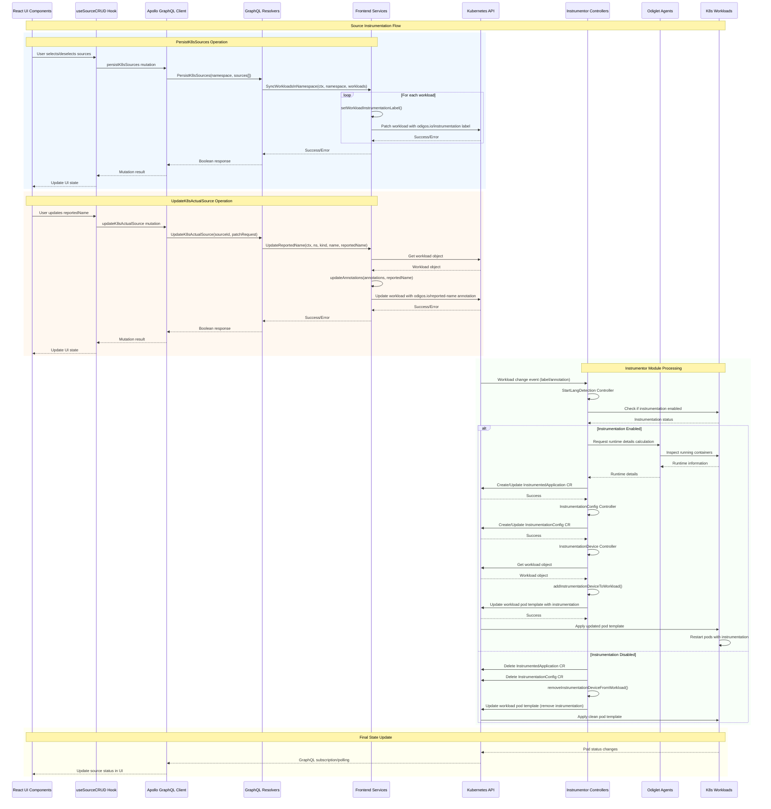

# Source Instrumentation Flow - Sequence Diagram

## Complete Flow: UI → Frontend → Instrumentor

## Key Components Breakdown

### Frontend Components
- **React UI**: Source management interface
- **useSourceCRUD Hook**: Custom hook managing source operations
- **Apollo Client**: GraphQL client for API communication
- **GraphQL Resolvers**: Backend resolvers handling mutations

### Service Layer
- **SyncWorkloadsInNamespace**: Bulk workload labeling
- **UpdateReportedName**: Individual source annotation updates
- **setWorkloadInstrumentationLabel**: Kubernetes label management

### Instrumentor Controllers
- **StartLangDetection Controller**: Detects newly labeled workloads
- **InstrumentationConfig Controller**: Creates SDK configurations
- **InstrumentationDevice Controller**: Injects instrumentation into pods

### Kubernetes Resources
- **Labels**: `odigos.io/instrumentation=enabled/disabled`
- **Annotations**: `odigos.io/reported-name=<custom-name>`
- **Custom Resources**: InstrumentedApplication, InstrumentationConfig
- **Workload Updates**: Pod templates with instrumentation devices

## Flow Summary

1. **UI Interaction**: User selects sources or updates properties
2. **GraphQL Layer**: Mutations processed by resolvers
3. **Service Layer**: Kubernetes API calls to update workloads
4. **Controller Watching**: Instrumentor controllers detect changes
5. **Instrumentation Injection**: Automatic injection of observability tools
6. **Pod Restart**: Workloads restart with instrumentation enabled
7. **Status Update**: UI reflects the new instrumentation status 