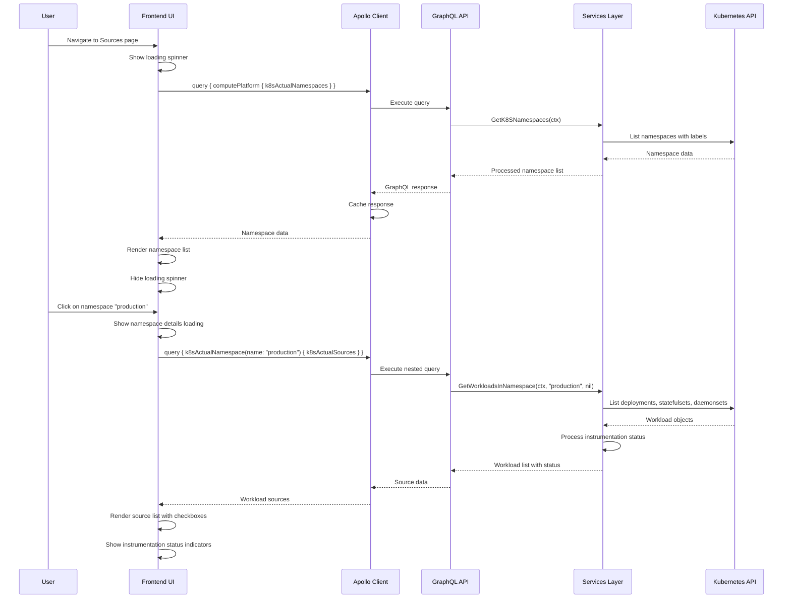
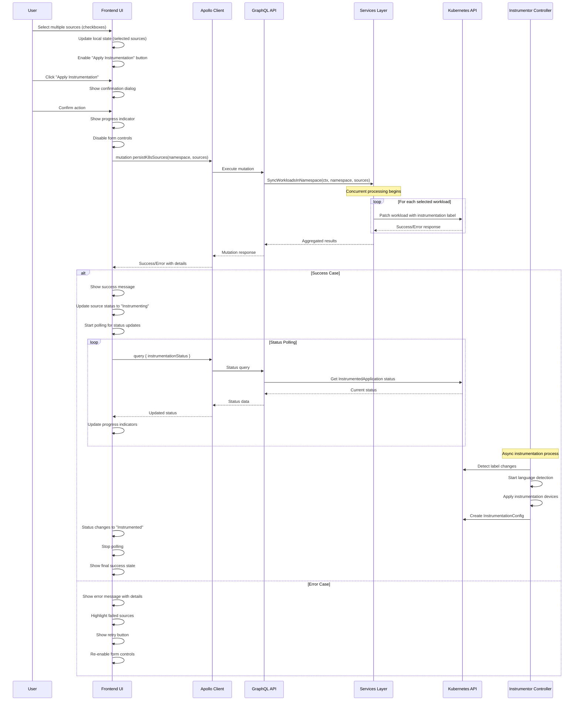
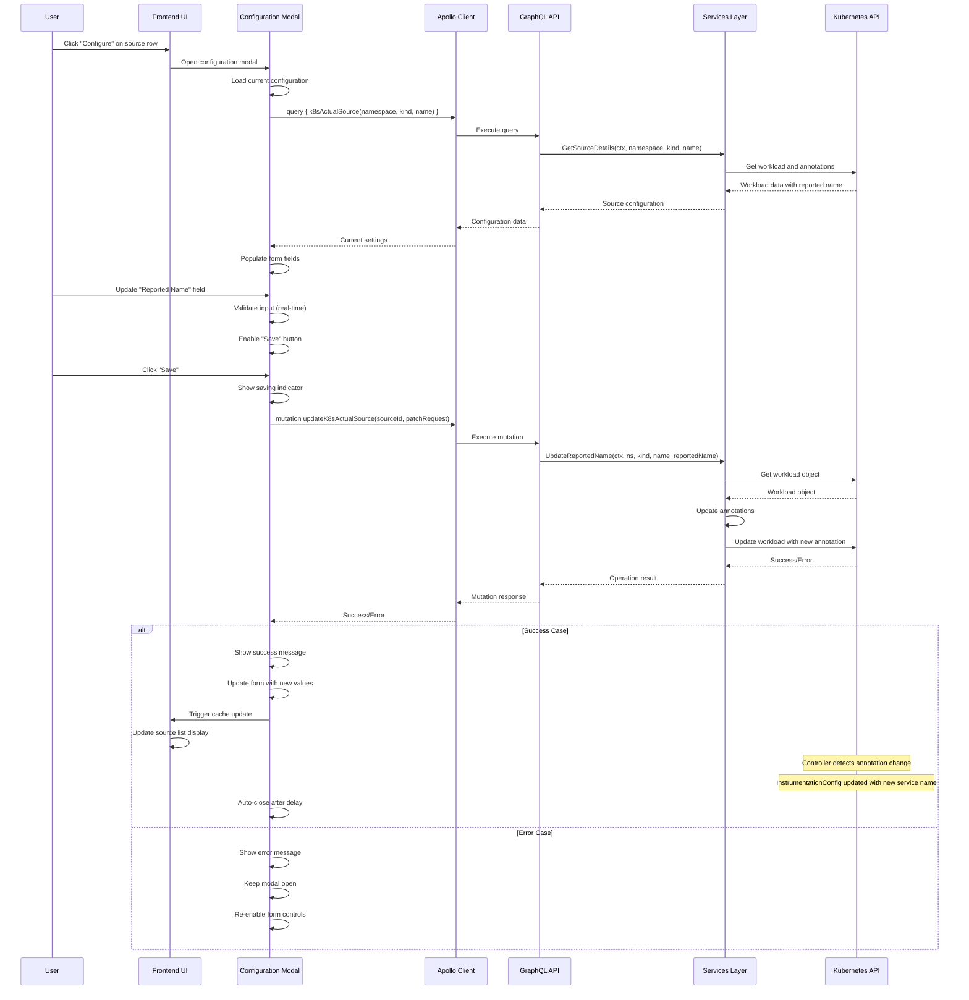
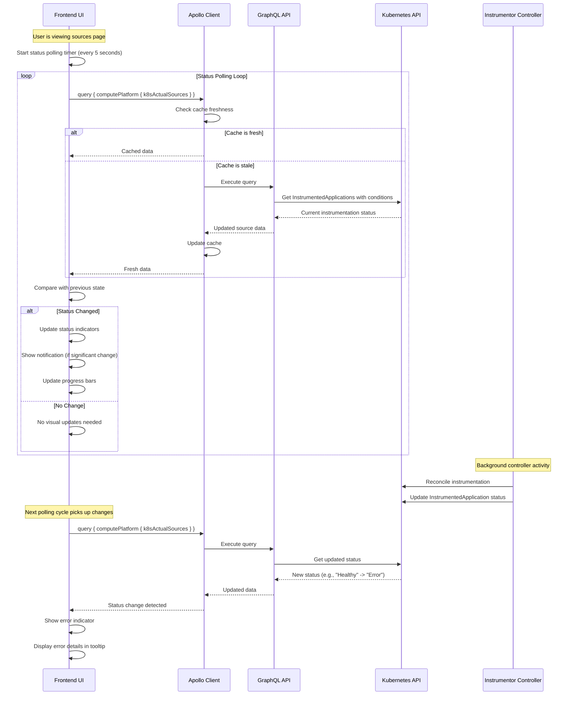
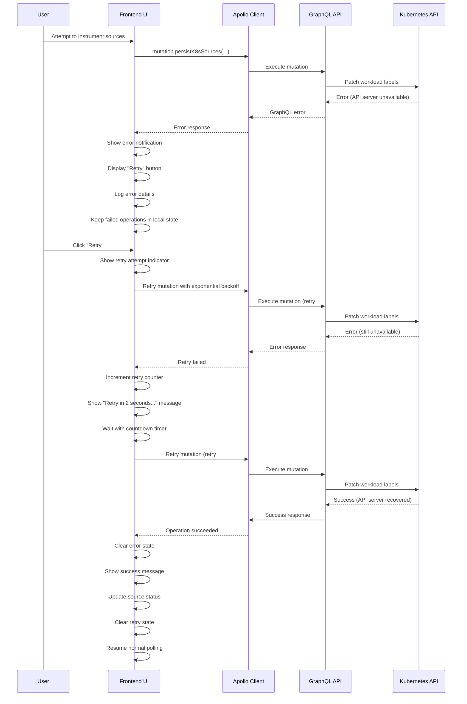
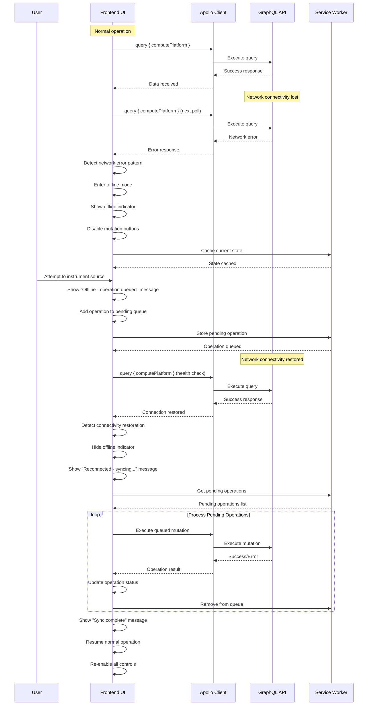
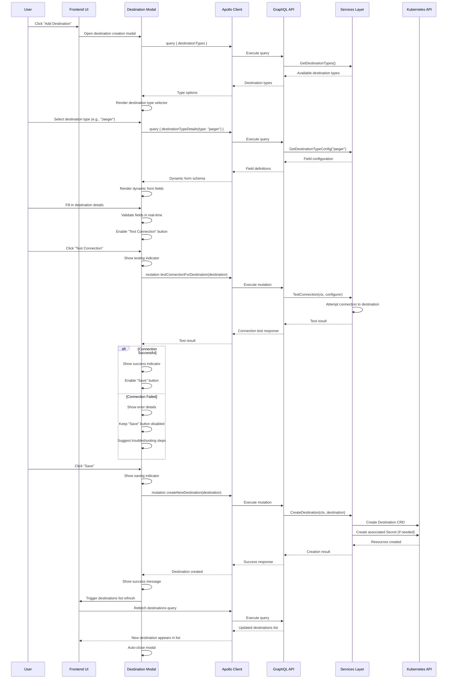

# UI Interaction Sequence Diagrams

## Complete User Workflows with UI State Management

### 1. **Source Discovery and Selection Workflow**



### 2. **Bulk Source Instrumentation Workflow**



### 3. **Individual Source Configuration Workflow**



### 4. **Real-time Status Updates Workflow**



### 5. **Error Recovery and Retry Workflow**



### 6. **Offline Mode and Connectivity Recovery**



### 7. **Destination Management Workflow**



## UI State Management Patterns

### 1. **Loading States**
```typescript
interface UIState {
  loading: {
    namespaces: boolean;
    sources: boolean;
    destinations: boolean;
    operations: {
      [operationId: string]: boolean;
    };
  };
  errors: {
    [component: string]: Error | null;
  };
  cache: {
    lastUpdated: Date;
    data: any;
  };
}
```

### 2. **Error Handling Patterns**
```typescript
interface ErrorState {
  type: 'network' | 'validation' | 'permission' | 'unknown';
  message: string;
  retryable: boolean;
  retryCount: number;
  lastRetry: Date;
  context: {
    operation: string;
    parameters: any;
  };
}
```

### 3. **Optimistic Updates**
```typescript
// Example: Optimistic source instrumentation
const handleInstrumentSource = async (sourceId: string) => {
  // 1. Optimistically update UI
  updateSourceStatus(sourceId, 'instrumenting');
  
  try {
    // 2. Execute mutation
    const result = await persistK8sSources(namespace, [source]);
    
    // 3. Confirm success
    updateSourceStatus(sourceId, 'instrumented');
  } catch (error) {
    // 4. Rollback on error
    updateSourceStatus(sourceId, 'not-instrumented');
    showErrorMessage(error);
  }
};
```

This comprehensive documentation covers all major UI interaction patterns, error scenarios, and state management approaches used in the Odigos frontend architecture. 